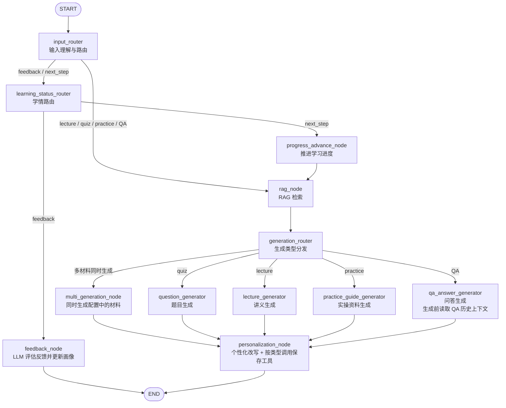
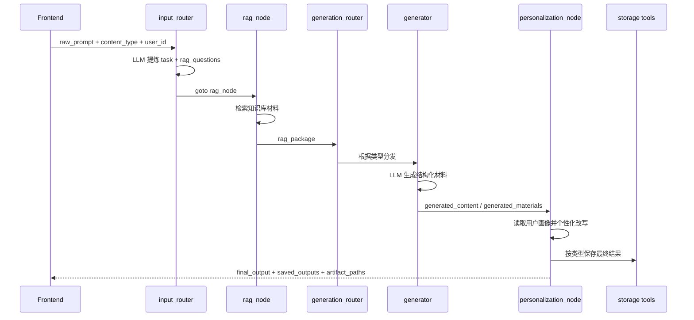
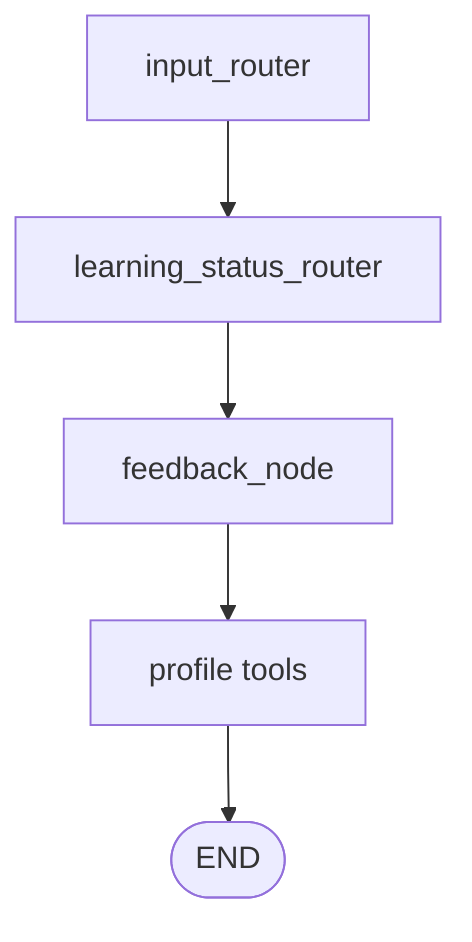
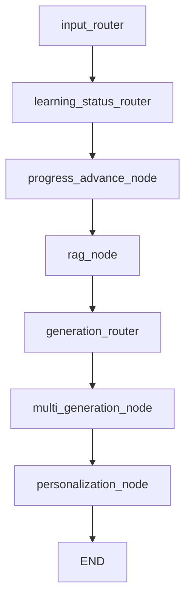

# LangGraph Demo Backend

本目录是一版面向智能学习系统的 LangGraph demo 后端。当前后端的核心目标是：根据前端传入的学习请求，完成输入理解、RAG 检索、学习材料生成、用户画像个性化、学情反馈更新、学习进度推进，以及学习资产本地归档。

当前版本主要服务于前后端联调和 Agent 工作流验证，尚不是完整生产 API 服务。

## 功能概览

当前后端支持以下能力：

- 输入理解：使用 LLM 将用户原始输入提炼为专业化 `task`，并拆解为 RAG 检索问题。
- RAG 检索：根据 `rag_questions` 检索本地知识库，形成 `rag_package`。
- 多类型材料生成：支持 `lecture`、`practice`、`quiz`、`qa` 四类内容生成。
- 多材料同时生成：学习进度推进时，可一次生成讲义、实操资料和题目。
- 个性化输出：根据用户画像 Markdown，通过 LLM 对最终输出进行个性化改写。
- 学情反馈：接收做题结果、QA 记录、讲义反馈、实训反馈等，由 LLM 评估后更新用户画像。
- 学习进度推进：读取用户当前学习进度，推进到下一阶段，并读取对应阶段的生成提示词。
- 本地资产保存：最终个性化结果会按类型保存到统一归档目录。
- QA 连续对话：同一个 `qa_session_id` 下的 QA 历史会保存到同一个会话文件夹，下次追问时自动带入上下文。

## 目录结构

```text
Langgraph_demo_7.27/
  agent/
    graph.py                    # LangGraph 图入口
    state.py                    # 全局 State 定义
    storage_layout.py            # 统一存储路径策略

    node/
      input_router.py            # 输入理解与一级路由
      rag_node.py                # RAG 检索节点
      generation_router.py       # 生成类型路由
      multi_generation_node.py   # 多材料生成节点
      generators.py              # lecture / practice / quiz / qa 生成节点
      personalization_node.py    # 个性化改写与最终保存
      learning_status_router.py  # 学情管理路由
      feedback_node.py           # 学情反馈处理
      progress_advance_node.py   # 学习进度推进
      node_logging.py            # 节点运行日志装饰器

    rag/
      config.py
      schemas.py
      simple_retriever.py
      storage/
        local_kb/
          indexes/               # 当前默认 RAG 索引
          manifests/             # 当前默认资料清单
          source/                # 当前默认原始资料回退目录

    profile/
      config.py
      manager.py
      markdown_store.py
      repository.py

    learning_archive/
      config.py
      manager.py
      artifact_store.py
      repository.py
      exporters.py

    learning_stages/
      stage_prompts.json         # 静态学习路径与阶段提示词
      loader.py

    tools/
      archive_tools.py
      profile_tools.py
      qa_tools.py
      quiz_tools.py

    storage/
      doc/             # 统一学习资产归档根目录

  tests/                         # 后端测试
  docs/                          # 方案文档
  .env                           # 本地环境变量
```

## 后端图关系

当前图入口统一是 `input_router`。它会判断用户请求是资料生成，还是学情管理。



## 主要链路

### 1. 资料生成链路

当前支持四类生成：

```text
lecture   讲义
practice  实操/实训资料
quiz      题目
qa        问题回答
```

流程如下：



注意：当前保存的是 `personalization_node` 之后的最终个性化结果，不保存 generator 的中间稿。

### 2. 学情反馈链路

当输入为 `feedback`，或输入内容被识别为学情反馈时，会进入学情管理链路：



`feedback_node` 会使用 LLM 判断反馈类型，并生成用户画像更新建议。支持的反馈类型包括：

```text
quiz_result
qa_dialogue
lecture_feedback
practice_feedback
mixed_feedback
unknown
```

画像数据会写入：

```text
agent/storage/doc/app.db
agent/storage/doc/users/<user_id>/profile/profile.md
```

### 3. 下一步学习链路

当前端传入 `next_step` 意图时，后端会读取用户当前学习进度，推进到下一学习阶段，并基于静态学习路径配置生成下一阶段材料。



学习路径配置位于：

```text
agent/learning_stages/stage_prompts.json
```

## 前端请求字段

推荐前端至少传入以下字段：

```json
{
  "request_id": "req_001",
  "user_id": "user_001",
  "course_id": "cnc_lathe",
  "chapter_id": "basic_components",
  "content_type": "lecture",
  "raw_prompt": "生成数控机床主要组成部分的讲义"
}
```

字段说明：

```text
request_id      请求 ID，便于日志与归档追踪
user_id         用户 ID，用于读取画像和保存用户资产
course_id       课程 ID
chapter_id      当前章节 ID
content_type    生成或处理类型
raw_prompt      用户原始输入
qa_session_id   QA 连续对话 ID，继续追问时使用
```

`content_type` 支持：

```text
lecture
practice
quiz
qa
QA
feedback
next_step
```

## 输出字段

前端重点关注以下返回字段：

```text
final_output
单材料最终输出，例如单个 lecture / quiz / practice / QA。

final_materials
多材料最终输出，例如 next_step 同时生成 lecture + practice + quiz。

saved_outputs
最终结果保存后的信息，按 lecture / practice / quiz / qa 分类。

lecture_artifact_paths
讲义 Markdown 路径。

practice_guide_artifact_paths
实操 Markdown 路径。

question_artifact_paths
题目 JSON 路径。

qa_session_id
QA 会话 ID。前端继续追问时需要带回。

qa_artifact_paths
QA 会话文件路径，包括 manifest、messages 和 transcript。

profile_md_ref
当前用户画像 Markdown 路径。

feedback_result
学情反馈处理结果。

profile_update_result
画像更新结果。
```

## 资产保存规则

统一归档根目录：

```text
agent/storage/doc/
```

### 讲义

`lecture` 保存为 Markdown：

```text
agent/storage/doc/users/<user_id>/lectures/<lecture_artifact_id>/lecture.md
```

### 实操资料

`practice` 保存为 Markdown：

```text
agent/storage/doc/users/<user_id>/practice_outputs/<practice_artifact_id>/practice.md
```

### 题目

`quiz` 保存为 JSON，不保存 Markdown：

```text
agent/storage/doc/users/<user_id>/questions/generated/<question_artifact_id>/questions.json
```

### QA 对话

QA 按会话文件夹保存，形式接近 Codex 对话：

```text
agent/storage/doc/users/<user_id>/conversations/<qa_session_id>/
  manifest.json
  messages.jsonl
  transcript.md
  attachments/
  exports/
```

其中：

```text
manifest.json   会话元信息
messages.jsonl  机器可读消息记录，每行一条 user / assistant 消息
transcript.md   人类可读对话记录
```

当前版本不做 Word/PDF 导出。即使传入 `export_formats=["docx", "pdf"]`，后端也不会生成对应文件，返回路径为空。

## QA 连续对话

如果是新 QA 请求，前端可以不传 `qa_session_id`。后端会创建新的会话，并在返回中给出：

```json
{
  "qa_session_id": "qa_xxxxx"
}
```

如果用户在同一个 QA 窗口继续追问，前端下一次请求必须带回同一个 `qa_session_id`：

```json
{
  "user_id": "user_001",
  "content_type": "QA",
  "qa_session_id": "qa_xxxxx",
  "raw_prompt": "那主轴和伺服系统有什么关系？"
}
```

后端会在 `qa_answer_generator` 生成前读取：

```text
agent/storage/doc/users/<user_id>/conversations/<qa_session_id>/messages.jsonl
```

并把历史对话作为 `conversation_context` 放入 LLM prompt。生成完成后，`personalization_node` 会把本轮用户问题和助手回答继续追加到同一个会话文件夹。

## 本地运行

进入 demo 目录：

```powershell
cd C:\Users\popkik\Desktop\项目管理\多AGNET揭榜挂帅\milt_agent_system\Langgraph_Demo\Langgraph_demo_7.27
```

准备 `.env`：

```text
DEEPSEEK_API_KEY=你的 DeepSeek API Key
```

运行图：

```powershell
python -m agent.graph
```

也可以在 Python 中直接调用：

```python
from agent.graph import graph

result = graph.invoke(
    {
        "request_id": "req_001",
        "user_id": "user_001",
        "course_id": "cnc_lathe",
        "chapter_id": "basic_components",
        "content_type": "lecture",
        "raw_prompt": "生成数控机床主要组成部分的讲义",
    }
)

print(result)
```

## 测试

运行后端测试：

```powershell
python -m pytest tests -k "not frontend_v1" -v
```

说明：

- `frontend_v1` 相关测试依赖前端页面文件，后端验证时可先排除。
- 当前后端核心测试覆盖输入路由、RAG 节点、生成节点、个性化节点、反馈节点、学习进度推进、画像工具、归档工具和 QA 上下文读取。

## 注意事项

- `.env` 中不要提交真实 API Key 到公开仓库。
- 默认 RAG 知识库位于 `agent/rag/storage/local_kb/`。其中 `indexes/` 是当前检索索引，`manifests/` 是资料清单，`source/` 是索引不可用时的原始资料回退目录。
- 当前版本以 Markdown / JSON 文件保存为主，不生成 DOCX/PDF。
- 前端不建议直接扫描 `agent/storage` 目录。更推荐通过后端返回的 `saved_outputs`、`artifact_paths`、`qa_session_id` 等字段继续操作。
