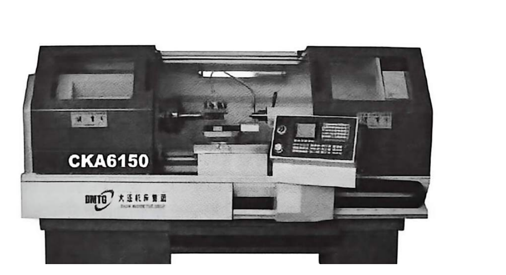
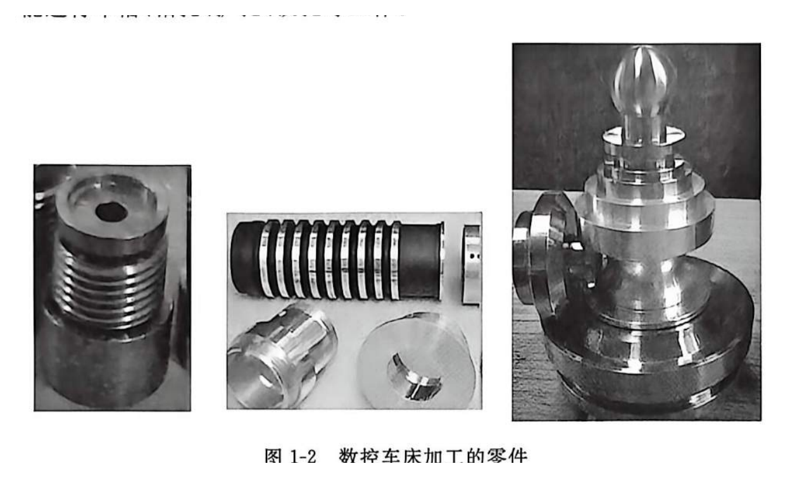
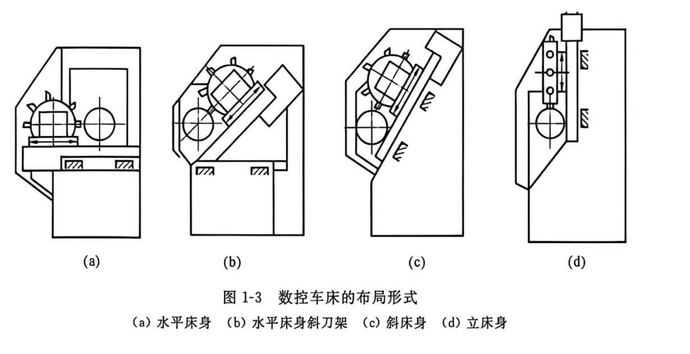
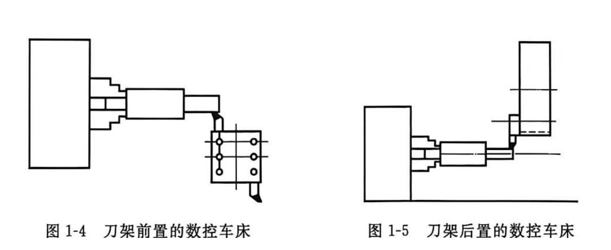
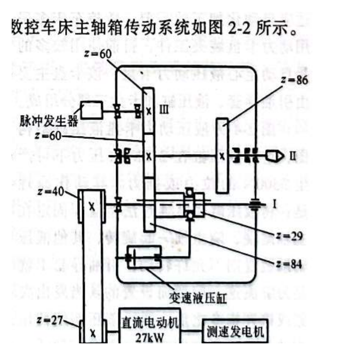
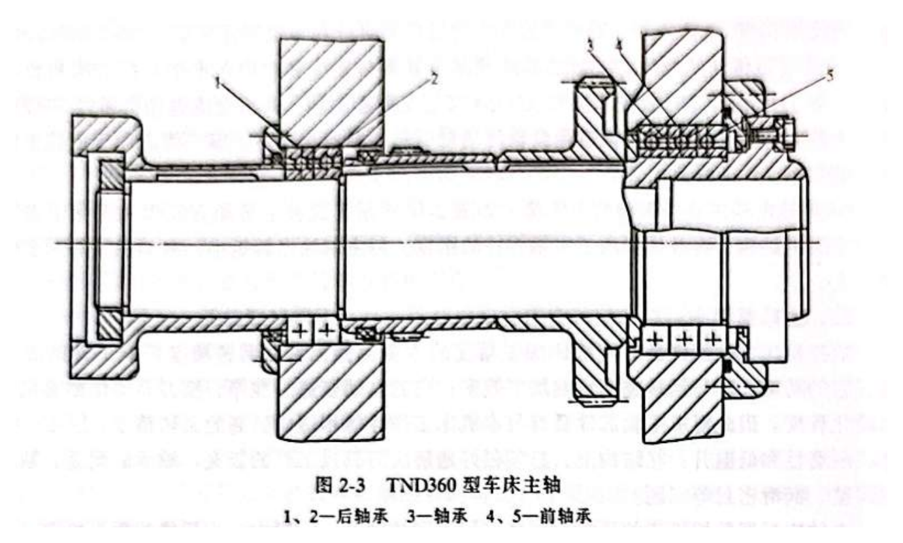
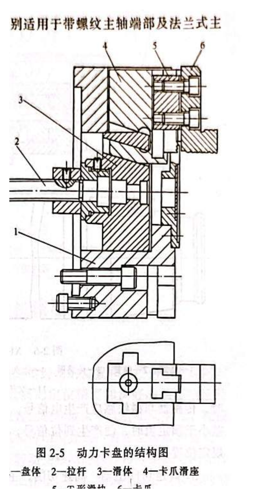
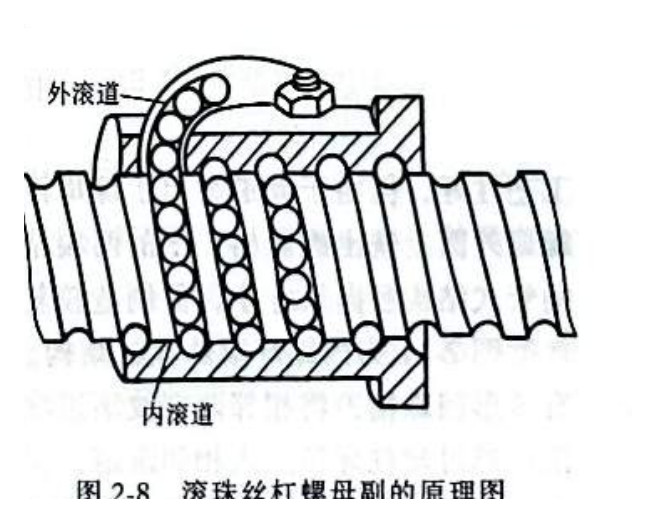
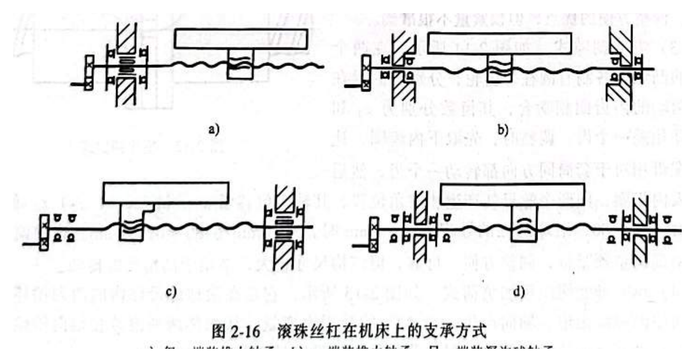

# 数控车床基础认知

> 章节归档：`chapter_01 / 1.1`  
> 适用对象：第一次接触数控车床的新员工、实习生、转岗人员  
> 学习定位：先建立“数控车床是什么、能做什么、由哪些部分组成”的整体认识，再进入安全、操作和编程学习。

## 一、学习目标

学完本讲义后，你应该能够：

1. 用自己的话说明数控车床和普通车床的区别。
2. 说出数控车床常见加工对象：轴类、盘类、套类等回转体零件。
3. 识别数控车床的常见布局形式、分类方式和基本构成。
4. 理解主轴、刀架、进给系统、卡盘等关键部件在加工中的作用。
5. 判断哪些零件更适合用数控车床加工。

## 二、先建立一个直观印象

数控车床是用数字化程序控制机床动作的自动化加工设备。加工时，程序会控制主轴启停与转速、刀具进退、进给速度、刀具选择、切削液等动作，使刀具和工件按预定轨迹相对运动。

**看图要点：**左侧为主轴和防护区域，中部是工件/刀具加工区域，右侧通常能看到控制面板。新人上机前要先把“机械加工区域”和“数控操作区域”区分开。

与普通车床相比，数控车床的核心变化不是“车削原理变了”，而是“由程序稳定地控制加工动作”。它适合多品种、小批量、尺寸精度要求较高、形状相对复杂的回转体零件。

## 三、数控车床能加工什么

数控车床主要加工绕某一轴线旋转形成的零件，也就是常说的回转体零件。典型对象包括：

- 外圆、内孔、端面、台阶轴。
- 圆锥面、圆弧面、成形面。
- 螺纹、槽、钻孔、扩孔、铰孔等。
- 尺寸难以人工稳定控制，或轮廓较复杂的轴类、盘类、套类零件。

**看图要点：**这些零件都有明显的旋转特征。判断一个零件是否适合车削，可以先问：它是不是围绕中心轴形成主要轮廓？加工重点是不是外圆、内孔、端面、螺纹或回转曲面？

## 四、数控车床的基本组成

一台典型数控车床可以从“控制、运动、夹持、切削、辅助”五个角度理解：

| 部分 | 新人需要理解的作用 |
| --- | --- |
| 数控系统 | 接收程序，解释指令，控制主轴、进给轴、刀架和辅助功能。 |
| 主轴系统 | 带动工件旋转，是车削运动的主要来源。 |
| 进给系统 | 控制刀具沿 X、Z 等方向运动，决定加工轨迹和尺寸。 |
| 刀架/刀塔 | 安装并切换车刀、切槽刀、螺纹刀等刀具。 |
| 夹具/卡盘 | 装夹工件，保证工件随主轴可靠旋转。 |
| 床身与导轨 | 支撑各运动部件，影响刚度、精度和排屑。 |
| 辅助系统 | 包括润滑、切削液、排屑、防护、限位等。 |

可以把数控车床理解为：**数控系统下指令，主轴让工件转，进给系统让刀具走，刀架提供合适刀具，卡盘把工件夹稳，床身和导轨保证整体稳定。**

## 五、床身与刀架布局

数控车床的主轴、尾座等部件与普通卧式车床有相似之处，但床身导轨和刀架布局对操作、排屑、刚度、防护和维护影响很大。常见布局包括水平床身、水平床身斜刀架、斜床身、立床身。

**看图要点：**

- 水平床身：工艺性好，导轨加工方便，但排屑空间较小。
- 水平床身斜刀架：保留较好工艺性，同时改善排屑和空间布置。
- 斜床身：常见于中小型数控车床，排屑、操作、防护较方便。
- 立床身：排屑条件好，但应用相对少。

刀架常见有前置和后置两种。刀架位置会影响操作者观察切削、测量工件、装刀数量和机床整体布局。

**看图要点：**前置刀架结构相对简单；后置刀架便于观察和测量，常见于功能较完善的卧式数控车床。无论哪种结构，刀具伸出过长都会降低刚性，容易引起振动或加工误差。

## 六、数控车床怎样分类

从数控系统功能和机械结构看，可以分为：

- **经济型数控车床：**控制部分较简单，常在普通车床基础上改造或简化设计，适合基本车削任务。
- **全功能数控车床：**由专门数控装置控制，功能更完整，适合更复杂、更稳定的加工。
- **数控车削中心：**在数控车床基础上增加附加坐标轴或复合功能，自动化和复合加工能力更强。

从结构和用途看，还可分为：

- **卧式数控车床：**常见，用于轴类、盘套类等零件。
- **立式数控车床：**主轴垂直，适合径向尺寸大、轴向尺寸较小的大型复杂零件。
- **专用数控车床：**用于凸轮、曲轴、丝杠等特定零件。

看到机床型号时，也可以快速读取部分信息。例如 `CK6140` 中，`C` 表示车床类，`K` 表示数控，`40` 通常表示最大回转直径约为 400 mm。

## 七、关键部件补充认知

### 1. 主轴系统

主轴部件影响加工精度、加工效率和自动化程度。它需要具备较好的回转精度、刚度、抗振性、耐磨性和低温升特性。

**看图要点：**主轴传动系统把电动机动力传递到主轴，并通过不同传动方式满足低速大扭矩、高速加工、螺纹加工同步等需求。对新人来说，先记住一句话：主轴不是只“转起来”就行，它还要按加工要求稳定、准确、可控地转。

**看图要点：**主轴内部包含轴承、主轴体和支承结构。轴承配置和预紧会影响刚度、回转精度和寿命。

### 2. 卡盘与夹紧

车削时，工件通常由卡盘夹持并随主轴旋转。夹紧不可靠会带来尺寸误差、振动，严重时会造成安全事故。

**看图要点：**液压系统通过拉杆、滑体和卡爪滑座带动卡爪夹紧或松开。实际操作中要关注夹紧直径、夹紧力、工件伸出长度和是否干涉刀具。

### 3. 进给系统与滚珠丝杠

进给系统决定刀具如何沿坐标轴运动。数控机床要求进给系统定位精度高、动态响应好、摩擦小、间隙小。

**看图要点：**滚珠丝杠把旋转运动转换成直线运动。滚珠在丝杠和螺母之间滚动，可以降低摩擦，提高传动效率和定位精度。

**看图要点：**丝杠支承方式会影响轴向刚度和传动精度。新人不需要马上掌握设计计算，但要知道“进给精度不仅由程序决定，也由机械传动链决定”。

## 八、数控车削最适合哪些零件

数控车床尤其适合以下加工对象：

1. **轮廓形状复杂的回转体零件**  
   例如由直线、圆弧、曲线组成的外形，普通车床人工控制难度较高，数控程序可以更稳定地完成。

2. **精度要求较高的回转体零件**  
   包括尺寸精度、形状精度、位置精度和表面质量要求较高的零件。

3. **特殊螺纹或多类型螺纹零件**  
   数控车床可加工多种直螺纹、锥螺纹、端面螺纹，也可通过程序实现更灵活的螺纹加工。

4. **多品种、小批量生产零件**  
   程序可复用、调整快，适合产品种类多但单批数量不大的场景。

## 九、新人容易混淆的点

- **数控不是万能。**程序再好，也需要正确装夹、正确刀具、可靠工艺和安全操作。
- **精度不是只靠程序。**机床刚度、主轴状态、刀具伸出、夹紧力、丝杠间隙、热变形都会影响精度。
- **车床主要加工回转体。**如果零件主要是平面轮廓、型腔或复杂空间曲面，可能更适合铣床或加工中心。
- **自动化不等于无人关注。**加工前要校验程序、检查坐标、确认刀具和夹具；加工中要观察异常声音、振动、切屑和切削液状态。

## 十、练习与例题（含参考答案与解析）

这一节把课堂练习和例题放在一起。每道题都包含“题目、参考答案、解析”，便于新人自学，也便于后续作为训练 AI 教学能力的结构化素材。

### 练习 1：看零件选机床

**题目：**判断以下零件是否适合数控车床加工，并说明理由。

**参考答案：**

| 零件 | 参考答案 | 简要理由 |
| --- | --- | --- |
| 台阶轴 | 适合 | 典型轴类回转体，有外圆、端面、台阶。 |
| 带螺纹套筒 | 适合 | 有内/外圆和螺纹特征。 |
| 平板上开多个孔 | 不一定 | 若主要是平面孔加工，通常更适合铣床或加工中心。 |
| 大直径短盘类零件 | 适合，但需看尺寸 | 可能适合立式数控车床或大型卧式车床。 |

**解析：**判断是否适合数控车床加工，首先看零件是否以回转体特征为主，其次看主要加工内容是否是外圆、内孔、端面、槽、螺纹、圆锥面或圆弧面。平板类零件即使有孔，也不一定适合车床加工，因为它的主要加工面不围绕回转轴形成。

### 练习 2：识别部件

**题目：**请在实物机床或图片上指出以下部件，并说明它们的作用：

- 主轴/卡盘位置。
- 刀架或刀塔位置。
- 控制面板位置。
- 床身和导轨方向。
- 切削液、排屑、防护门的大致位置。

**参考答案：**

- 主轴/卡盘：带动工件旋转并完成装夹。
- 刀架或刀塔：安装和切换车刀、切槽刀、螺纹刀等刀具。
- 控制面板：输入、调用、编辑和运行程序，控制机床动作。
- 床身和导轨：支撑运动部件并保证运动方向和刚度。
- 切削液、排屑、防护门：分别用于冷却润滑、清理切屑和保障安全。

**解析：**新人识别机床时，不要只记名称，要把“部件位置”和“加工中的作用”连起来。这样后续学习开机、回参考点、装夹、对刀和程序校验时，才能理解每一步操作影响的是哪一部分。

### 练习 3：复述流程

**题目：**用 1 分钟说明数控车床完成一次车削加工大致经历哪些环节。

**参考答案：**

1. 根据图纸确定工艺、刀具和装夹方式。
2. 编写或调用加工程序。
3. 装夹工件、安装刀具、设置坐标系。
4. 校验程序并进行空运行或单段运行。
5. 首件试切并测量修正。
6. 稳定加工并观察异常。
7. 加工结束后清理、检查、记录。

**解析：**这道题训练的是整体流程意识。新人不需要一开始背下所有操作细节，但要知道数控车削不是“按启动键就加工”，而是从图纸、工艺、装夹、对刀、校验、试切到稳定加工的一整套闭环。

### 例题 1：判断加工对象

**题目：**某零件为直径 35 mm、长度 120 mm 的台阶轴，外圆上有两个台阶、一个退刀槽和一段普通外螺纹。它是否适合在数控车床上加工？为什么？

**参考答案：**适合。

**解析：**该零件是典型轴类回转体，主要加工内容包括外圆、台阶、槽和螺纹，都是数控车床常见加工对象。数控程序可以稳定控制刀具沿轴向和径向运动，适合保证台阶尺寸、槽位置和螺纹参数。

### 例题 2：识别机床型号

**题目：**已知 `CK6140` 是一种数控车床型号，请解释其中 `C`、`K`、`40` 的基本含义。

**参考答案：**`C` 表示车床类，`K` 表示数控，`40` 通常表示机床主参数，最大回转直径约为 400 mm。

**解析：**机床型号能帮助新人快速判断设备类别和大致加工范围。型号解释不能代替机床铭牌和说明书，但可以作为认识设备的第一步。

### 例题 3：选择床身布局

**题目：**某车间希望中小型数控车床排屑更方便、操作者观察和防护更好，常会优先考虑哪类床身布局？它有什么特点？

**参考答案：**可优先考虑斜床身或水平床身斜刀架布局。

**解析：**斜床身和斜刀架布局有利于切屑下落和排出，也便于防护结构布置。水平床身工艺性好，但排屑空间较小；立床身排屑条件好，但应用相对少。

### 例题 4：分析刀架位置

**题目：**为什么后置刀架常被认为更便于观察工件和测量工件？它是否意味着所有情况下都优于前置刀架？

**参考答案：**后置刀架通常让操作者更容易观察加工区域和测量工件，但不代表所有情况下都优于前置刀架。

**解析：**刀架位置会影响观察、测量、装刀数量、机床结构和切削范围。前置刀架结构相对简单，后置刀架在观察和操作便利性上有优势。实际选择要结合机床结构、加工对象、刀具布置和车间习惯。

### 例题 5：判断异常来源

**题目：**加工同一批轴类零件时，程序没有修改，但零件外圆尺寸开始不稳定，并伴随轻微振动。可能优先检查哪些方面？

**参考答案：**优先检查工件夹紧、刀具伸出和磨损、主轴/卡盘状态、进给系统间隙或导轨状态，以及切削参数是否合适。

**解析：**数控加工精度不只由程序决定。夹紧力不足、刀具磨损、刀具伸出过长、主轴或卡盘状态异常、进给传动间隙、切削参数不合理，都可能导致尺寸波动和振动。新人遇到异常时，应先停机确认安全，再按“装夹-刀具-主轴-进给-参数”的顺序排查。

## 十一、本节小结

数控车床的本质，是用数字化程序控制车削加工过程。新人学习时不要一开始就陷入 G 代码细节，而应先建立三层认识：

- **加工对象：**主要是轴类、盘类、套类等回转体零件。
- **机床结构：**主轴、进给、刀架、卡盘、床身、数控系统共同完成加工。
- **加工能力：**适合精度较高、形状较复杂、多品种小批量的车削任务。

有了这三个框架，再学习安全规范、开关机、回参考点、装夹、对刀和编程，会更容易把每个操作放回整体逻辑中理解。

## 参考资料

- `数控车床基础理论培训大纲.docx`
- `数控加工编程与操作教程_华中数控_OCR可复制版_前六面.pdf`
- `数控机床原理及应用_OCR可复制版_第16-46页.pdf`
