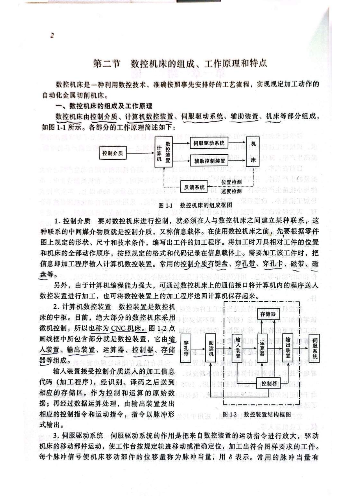
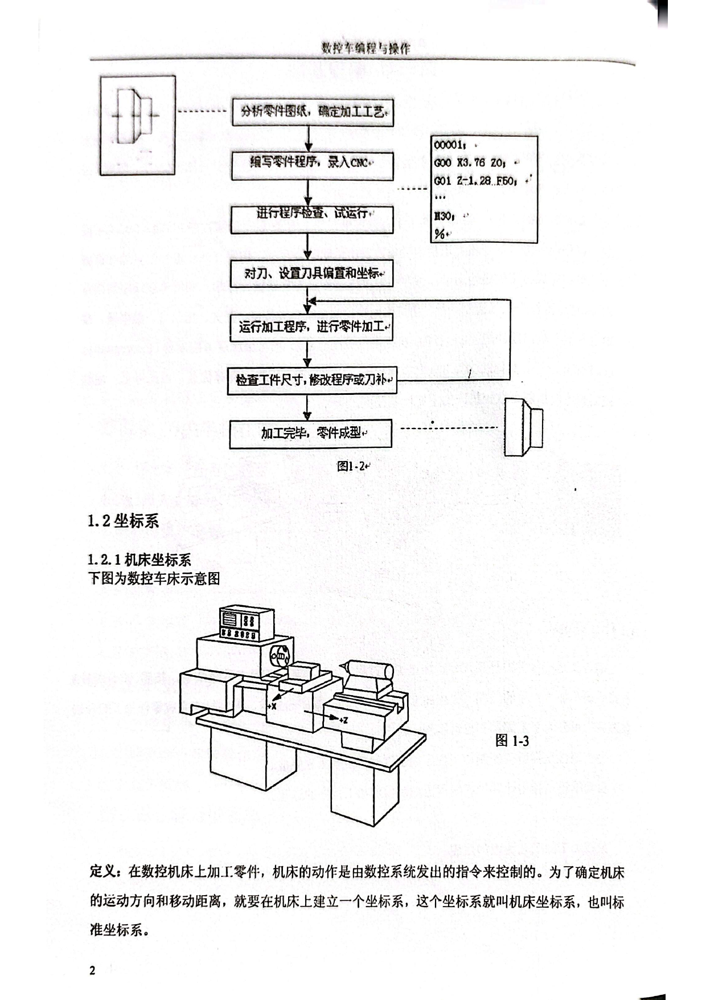
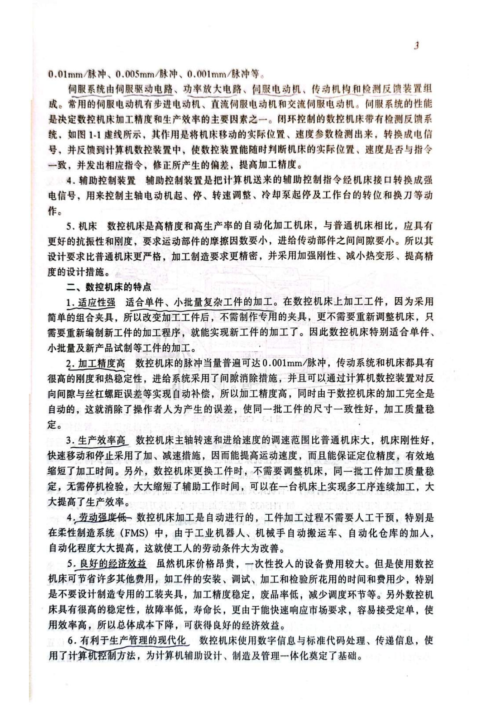

# 数控机床组成工作原理与特点

> 章节归档：`chapter_01 / 1.2`  
> 适用对象：已经初步认识数控车床的新员工、实习生、转岗人员  
> 学习定位：从“数控机床由什么组成、程序怎样变成机床动作、数控机床为什么适合复杂零件加工”三个问题入手。

## 一、学习目标

学完本讲义后，你应该能够：

1. 说出数控机床的主要组成部分。
2. 用自己的话说明加工程序如何控制机床运动。
3. 区分运动控制和逻辑控制。
4. 说明伺服驱动系统、辅助控制装置和机床本体的作用。
5. 概括数控机床的主要特点和适用生产场景。

## 二、数控机床由哪些部分组成

数控机床不是单独的一台“机械设备”，而是机械、电气、控制、检测和软件共同组成的自动化加工系统。

可以把它拆成五个基本部分：

| 部分 | 新人要理解的作用 |
| --- | --- |
| 控制介质 | 承载加工程序，是人与机床之间传递加工信息的载体。 |
| 计算机数控装置 | 接收、识别、计算加工程序，发出运动和控制指令。 |
| 伺服驱动系统 | 放大运动指令，驱动机床移动部件按要求运动。 |
| 辅助控制装置 | 控制主轴启停、冷却、润滑、换刀等辅助动作。 |
| 机床本体 | 承担实际切削加工，包括主轴、床身、导轨、工作台或刀架等。 |

## 三、加工程序怎样变成机床动作

数控加工的基本逻辑是：

1. 根据零件图样和工艺要求编写加工程序。
2. 将程序输入 CNC。
3. CNC 对程序进行识别、译码和运算。
4. CNC 输出运动控制指令给伺服系统。
5. 伺服系统驱动进给轴或工作台运动。
6. CNC 通过电气控制系统或 PLC 控制主轴、刀具、冷却、润滑等辅助动作。
7. 机床按程序要求完成零件加工。

新人可以先记住一句话：**程序负责说清“做什么”，CNC 负责解释和下命令，伺服和机床负责真正动起来。**

## 四、两个控制任务：运动控制和逻辑控制

### 4.1 运动控制

运动控制负责刀具和工件之间的位置、方向、速度和轨迹。

例如：

- X 轴、Z 轴移动多少。
- 以什么进给速度移动。
- 走直线、圆弧还是其他轨迹。

### 4.2 逻辑控制

逻辑控制负责开关类、顺序类和辅助类动作。

例如：

- 主轴启动与停止。
- 刀具选择。
- 冷却液开关。
- 润滑、夹紧、换刀等动作。

很多机床会用 PLC 完成这类输入输出控制。对新人来说，不需要一开始就深挖 PLC 程序，但要知道：按钮、开关、指示灯、继电器、接触器等动作，通常属于逻辑控制范围。

## 五、伺服驱动系统为什么重要

伺服驱动系统把 CNC 发出的运动指令放大，并驱动机床移动部件运动。

伺服系统通常包括：

- 伺服驱动电路。
- 功率放大电路。
- 伺服电动机或步进电动机。
- 机械传动机构。
- 位置或速度检测反馈装置。

伺服系统性能会直接影响：

- 加工精度。
- 定位精度。
- 运动速度。
- 生产效率。

## 六、反馈系统的作用

有些数控机床带有检测反馈系统。它会把机床实际位置、速度等信息检测出来，再反馈给 CNC。

这样 CNC 就能比较：

- 指令要求的位置在哪里。
- 机床实际到达的位置在哪里。

如果两者有偏差，系统再发出修正指令。这个过程能提高加工精度。

## 七、数控机床的主要特点

### 7.1 适应性强

数控机床特别适合单件、小批量、复杂工件和新产品试制。换产品时，通常不需要像普通机床那样大量调整机床，而是重新编制或调用程序。

### 7.2 加工精度高

数控机床刚度、热稳定性和进给传动精度较高，还能通过数控系统补偿间隙或误差，减少人为误差。

### 7.3 生产效率高

数控机床可以用较高主轴转速和进给速度工作，自动化程度高，辅助时间少，一台机床也可以完成多个工序。

### 7.4 劳动强度低

加工过程主要由程序控制，操作者更多负责装夹、监控、测量和异常处理。

### 7.5 有利于现代化生产管理

数控机床使用数字信息和标准代码，便于和计算机辅助设计、制造、管理系统连接。

## 八、课堂练习和例题

### 练习 1：组成判断

**题目：**数控机床通常由哪些基本部分组成？

**参考答案：**控制介质、计算机数控装置、伺服驱动系统、辅助控制装置和机床本体。

**解析：**这五部分构成从程序输入到机床执行加工的完整链路。

### 练习 2：CNC 的作用

**题目：**计算机数控装置在数控机床中起什么作用？

**参考答案：**它接收加工程序，进行识别、译码和运算，并输出运动指令和控制指令。

**解析：**CNC 是数控机床的控制中枢，不直接切削，但负责解释程序和发出命令。

### 练习 3：运动控制

**题目：**控制 X 轴、Z 轴的移动方向、速度和距离，属于运动控制还是逻辑控制？

**参考答案：**运动控制。

**解析：**凡是和机床坐标轴运动轨迹、速度、位置有关的控制，都属于运动控制。

### 练习 4：逻辑控制

**题目：**主轴启停、冷却液开关、润滑启停属于哪类控制？

**参考答案：**逻辑控制。

**解析：**这些动作主要是开关量和顺序控制，通常由电气控制系统或 PLC 完成。

### 例题 1：加工流程

**题目：**为什么说“程序不是直接推着刀具走”，而是先经过 CNC 和伺服系统？

**参考答案：**因为程序需要先由 CNC 识别、译码和运算，再由伺服系统放大运动指令并驱动机床移动部件。

**解析：**程序只是数字化指令，真正的运动要靠 CNC 解释和伺服驱动执行。

### 例题 2：适用场景

**题目：**为什么数控机床适合单件、小批量复杂零件加工？

**参考答案：**因为更换加工对象时主要通过更换或修改程序实现，不需要大量制作专用夹具或重新调整机床。

**解析：**数控机床的柔性来自程序控制，能较快适应不同零件。

## 九、本章小结

本章可以归纳成一条链：

`加工程序 -> CNC 运算 -> 伺服驱动 -> 机床运动 -> 辅助控制配合 -> 完成加工`

理解这条链，新人就能知道数控机床不是“按按钮就自动加工”，而是程序、控制、驱动、机械和辅助系统共同工作的结果。
