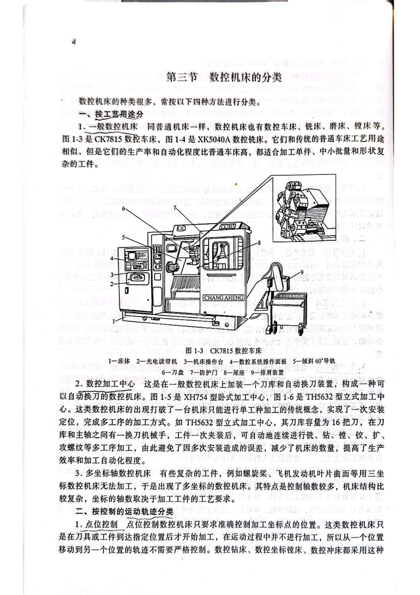
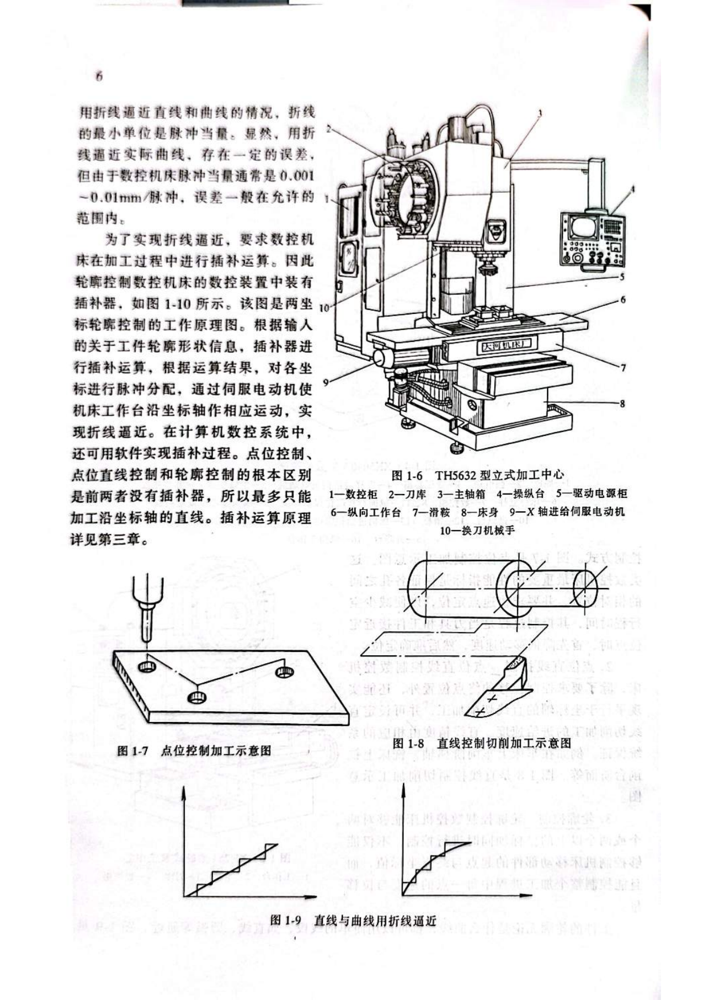
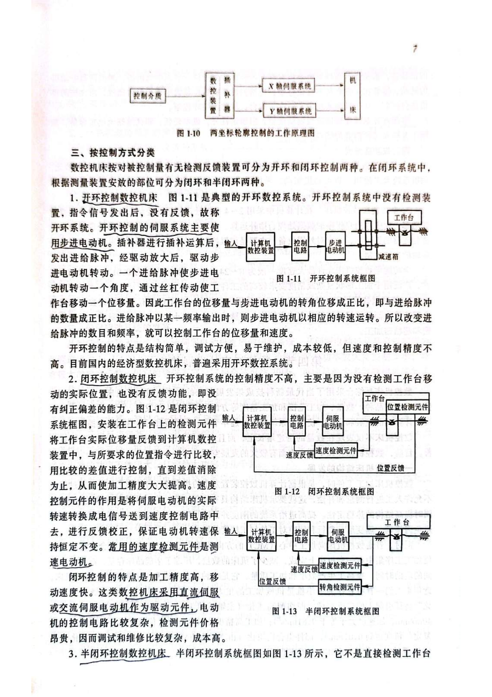
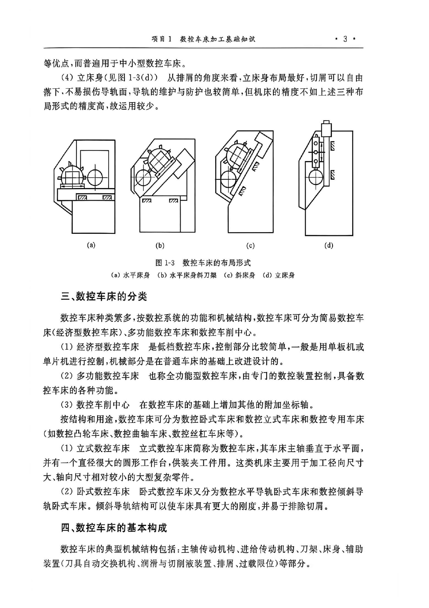

# 数控机床分类与数控车床类型

> 章节归档：`chapter_01 / 1.3`  
> 适用对象：已经知道数控机床基本组成的新员工、实习生、转岗人员  
> 学习定位：建立“数控机床怎样分类、数控车床属于哪一类、不同类型适合什么任务”的分类框架。

## 一、学习目标

学完本讲义后，你应该能够：

1. 按工艺用途说出常见数控机床类型。
2. 区分点位控制、点位直线控制和轮廓控制。
3. 区分开环、闭环和半闭环控制系统。
4. 说明经济型、全功能型、精密型数控机床的差异。
5. 说清数控车床常见分类、布局形式和适用加工对象。

## 二、按工艺用途分类

数控机床可以按工艺用途分成多个类别。常见的有数控车床、数控铣床、数控磨床、数控镗床、加工中心和多坐标轴数控机床。

### 2.1 一般数控机床

一般数控机床和普通机床的工艺用途相似，例如：

- 数控车床用于车削回转体零件。
- 数控铣床用于铣削平面、沟槽、轮廓等。
- 数控磨床用于磨削加工。
- 数控镗床用于孔系加工。

它们比普通机床有更高的自动化程度和生产效率，更适合单件、中小批量和形状复杂的工件。

### 2.2 数控加工中心

加工中心是在一般数控机床基础上增加刀库和自动换刀装置。

它的特点是：

- 工件一次装夹。
- 可自动连续完成多工序加工。
- 减少多次装夹误差。
- 提高加工效率和自动化程度。

### 2.3 多坐标轴数控机床

多坐标轴数控机床用于普通三坐标机床难以加工的复杂曲面，例如螺旋桨、发动机叶片等。

它的控制轴数更多，结构也更复杂。

## 三、按运动轨迹分类

### 3.1 点位控制

点位控制只要求准确控制目标点位置。

运动过程中一般不加工，只要到达指定位置后再加工。

典型设备：

- 数控钻床。
- 数控坐标镗床。
- 数控冲床。

### 3.2 点位直线控制

点位直线控制除了控制终点位置，还能沿坐标轴方向做直线切削，并可设定直线切削进给速度。

例如：

- 车床车削阶梯轴。
- 铣床铣削台阶面。

### 3.3 轮廓控制

轮廓控制能同时控制两个或两个以上坐标轴，不只控制起点和终点，还控制加工过程中每一点的速度和位移。

复杂轮廓可以用直线、圆弧等线段逼近。为了实现这种控制，系统需要进行插补运算。

数控车床进行圆弧、圆锥、成形轮廓加工时，就离不开轮廓控制思想。

## 四、按控制方式分类

### 4.1 开环控制

开环控制没有检测反馈装置。系统发出指令后，不检测工作台或刀具是否真实到位。

特点是：

- 结构简单。
- 调试方便。
- 成本较低。
- 精度和速度相对不高。

国内很多经济型数控机床采用开环系统。

### 4.2 闭环控制

闭环控制带有检测反馈装置，能够检测工作台实际位移，并反馈给数控装置。

特点是：

- 加工精度高。
- 移动速度快。
- 控制电路复杂。
- 成本和维修难度较高。

### 4.3 半闭环控制

半闭环控制不直接检测工作台位置，而是通过与伺服电动机相关的检测元件，如光电编码器，推算实际位置并反馈。

它兼顾了精度、稳定性、成本和维护难度，是很多机床常见的折中方案。

## 五、按功能水平分类

### 5.1 经济型数控机床

经济型数控机床功能较简单，常采用开环控制和步进电动机驱动，成本较低，适合基础加工任务。

### 5.2 全功能型数控机床

全功能型数控机床控制能力更强，能实现较复杂的连续控制，适合形状复杂或精度要求较高的工件。

### 5.3 精密型数控机床

精密型数控机床通常采用闭环控制，机械系统动态响应更快，适合精密和超精密加工。

## 六、数控车床自身怎样分类

### 6.1 按系统功能和机械结构分

数控车床可分为：

- `经济型数控车床`：控制部分较简单，多适合基础车削。
- `多功能数控车床`：也叫全功能型数控车床，功能更完整。
- `数控车削中心`：在数控车床基础上增加附加坐标轴或复合加工能力。

### 6.2 按结构和用途分

数控车床还可分为：

- `卧式数控车床`：常见类型，适合轴类、盘套类零件。
- `立式数控车床`：主轴垂直，适合径向尺寸大、轴向尺寸相对较小的大型复杂零件。
- `专用数控车床`：如数控凸轮车床、数控曲轴车床、数控丝杠车床等。

### 6.3 常见床身布局

常见布局包括：

- 水平床身。
- 水平床身斜刀架。
- 斜床身。
- 立床身。

斜床身和水平床身斜刀架通常排屑较方便，操作和防护也较好，常见于中小型数控车床。

## 七、数控车床适合加工什么

数控车削适合加工回转体零件，尤其是：

- 轮廓形状复杂或尺寸难控制的回转体零件。
- 精度要求较高、尺寸一致性要求好的轴类、盘类、套类零件。
- 需要自动完成外圆、内孔、端面、圆锥面、圆弧面、螺纹、槽等工序的零件。

判断一个零件是否适合数控车床，可以先问三个问题：

1. 它的主要形状是不是围绕轴线旋转形成？
2. 加工重点是不是外圆、内孔、端面、螺纹、槽或回转曲面？
3. 是否需要稳定尺寸、重复加工或复杂轮廓控制？

## 八、课堂练习和例题

### 练习 1：用途分类

**题目：**加工中心和一般数控机床相比，多了什么关键装置？

**参考答案：**刀库和自动换刀装置。

**解析：**加工中心能一次装夹后连续完成多工序加工，关键在于刀库和自动换刀能力。

### 练习 2：点位控制

**题目：**点位控制最关心运动过程中的轨迹，还是目标点位置？

**参考答案：**目标点位置。

**解析：**点位控制在运动过程中一般不加工，重点是准确到达指定位置。

### 练习 3：轮廓控制

**题目：**轮廓控制为什么需要插补运算？

**参考答案：**因为它要控制加工过程中每一点的速度和位移，用直线、圆弧等逼近复杂轮廓。

**解析：**插补运算是轮廓加工中生成连续运动轨迹的重要方法。

### 练习 4：开环控制

**题目：**开环控制系统为什么成本较低但精度相对不高？

**参考答案：**因为它没有检测反馈装置，结构简单、成本低，但不能实时检测和修正实际位置偏差。

**解析：**没有反馈就缺少纠偏能力，这是开环控制的核心特点。

### 例题 1：分类判断

**题目：**某设备带刀库和自动换刀装置，工件一次装夹后能完成铣、钻、镗等多工序加工，它更接近哪类机床？

**参考答案：**数控加工中心。

**解析：**刀库、自动换刀和多工序连续加工是加工中心的典型特征。

### 例题 2：车床类型判断

**题目：**一个大型工件径向尺寸很大、轴向尺寸较小，通常更适合卧式数控车床还是立式数控车床？

**参考答案：**立式数控车床。

**解析：**立式数控车床主轴垂直，适合径向尺寸大、轴向尺寸相对较小的大型复杂零件。

## 九、本章小结

分类不是为了背名词，而是为了判断设备能力。

- 按用途看，知道它能做哪类工艺。
- 按轨迹看，知道它能不能加工复杂轮廓。
- 按控制方式看，知道它的精度、成本和维护特点。
- 按功能水平看，知道它适合基础加工、复杂加工还是精密加工。

学会分类，新人后面看到一台设备时，就能更快判断它能做什么、不能做什么，以及为什么这样安排加工任务。
