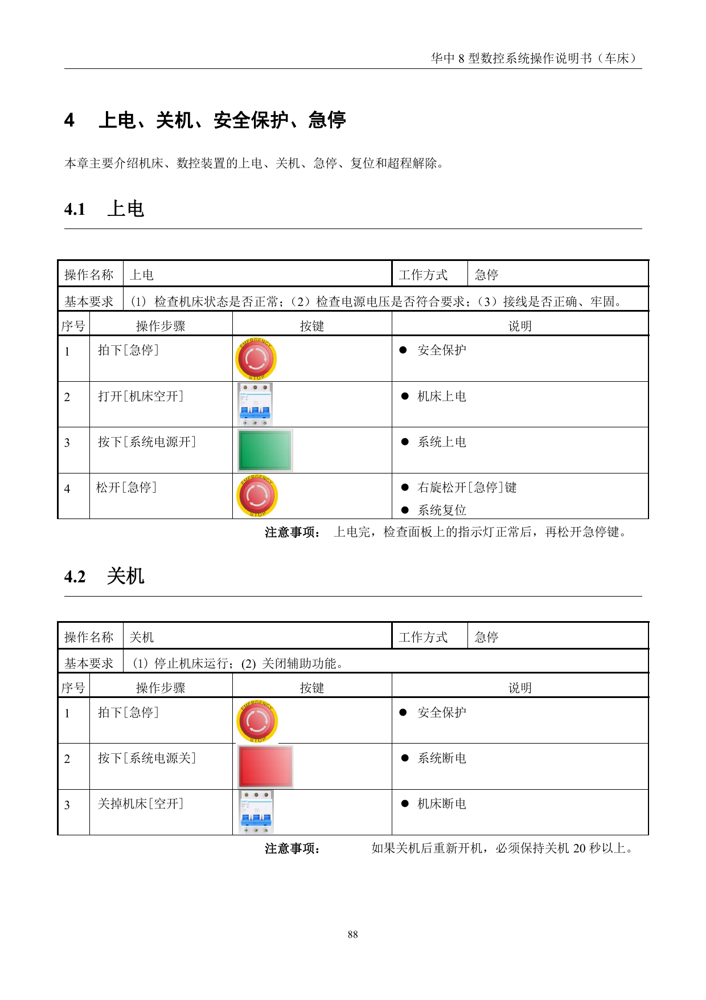
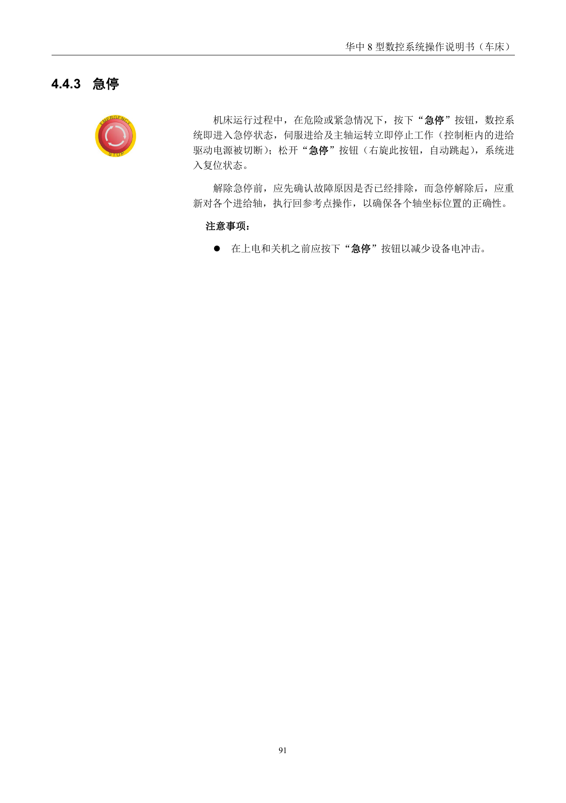
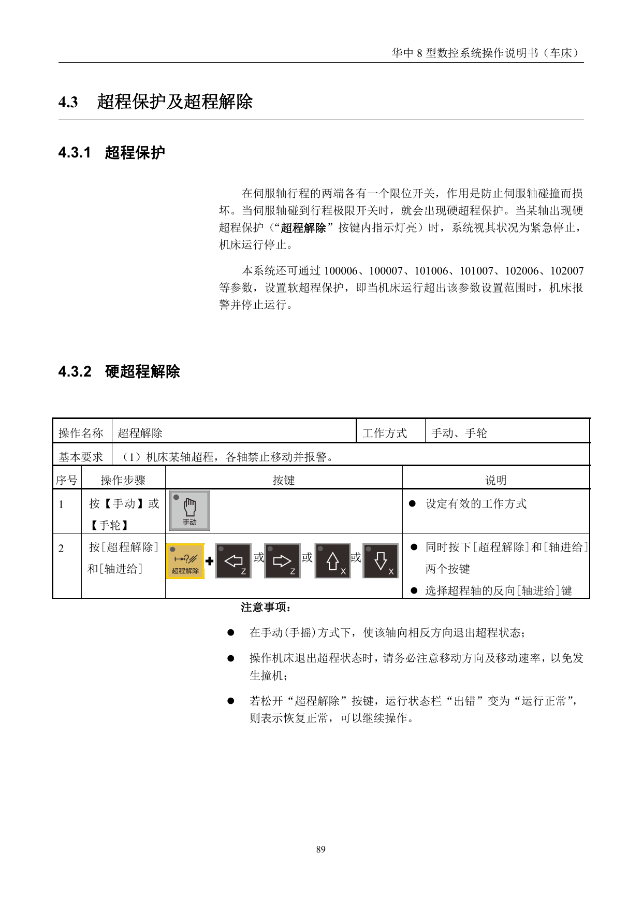
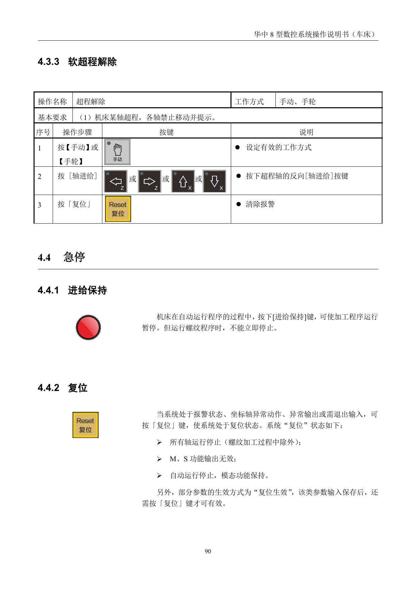
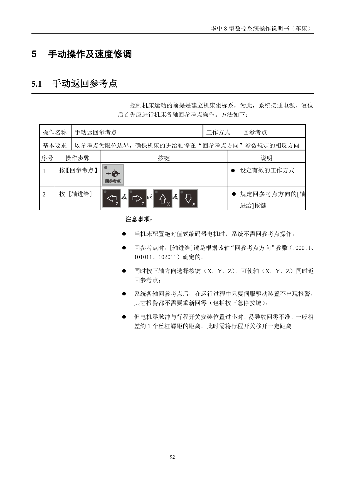
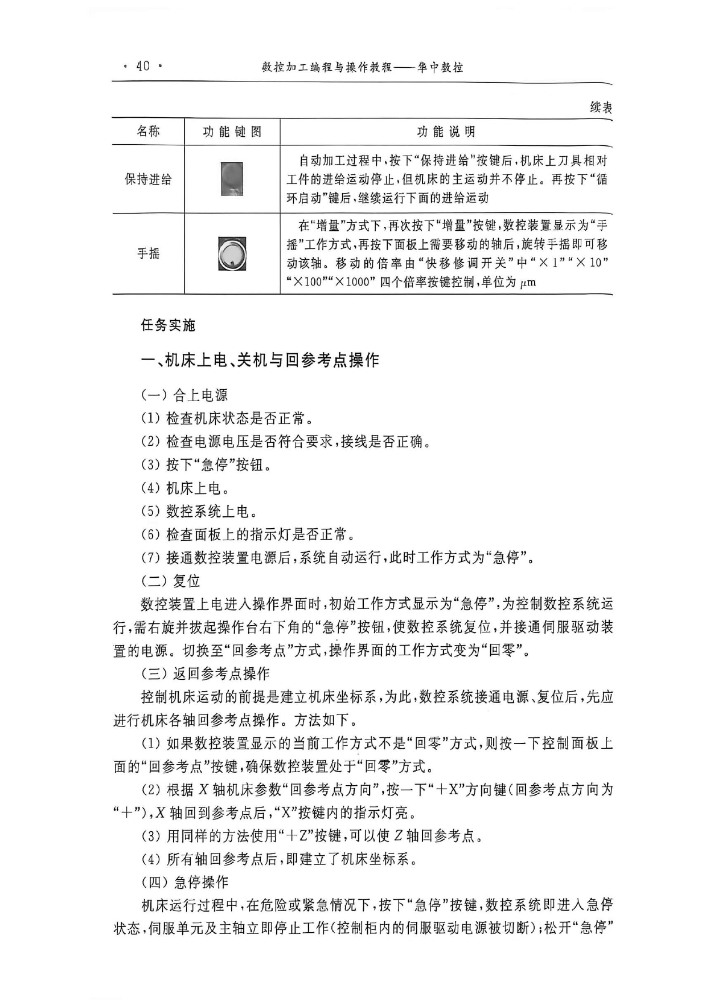
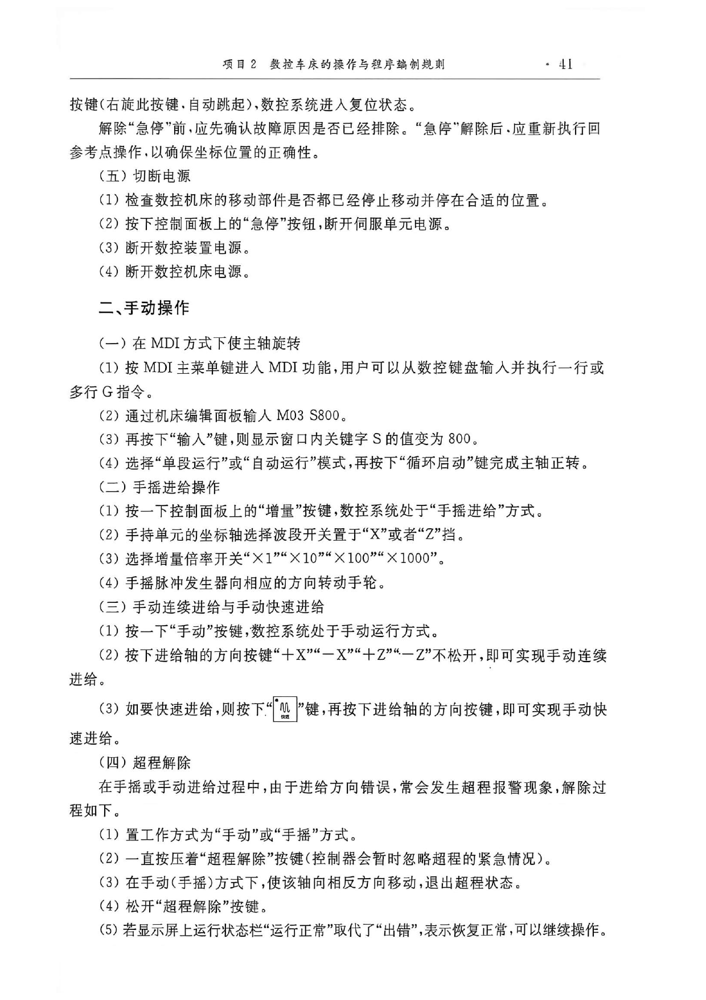

# 数控系统上电关机与手动操作

> 章节归档：`chapter_03 / 3.1`  
> 适用对象：刚接触数控车床的新人、上岗前培训学员  
> 学习定位：先把电上好、危险停住、超程退掉、参考点回准，再进入手动找位和低速操作

## 一、学习目标

学完本讲义后，你应该能够：

1. 说出数控车床上电前必须先确认的安全事项。
2. 按正确顺序完成上电、关机、急停和复位。
3. 识别超程保护，并会按步骤退出超程状态。
4. 说清回参考点、手动、手轮、MDI 和进给保持的用途。
5. 按任务实施流程完成最基础的上机准备和手动操作。

## 二、先记住几个关键状态

数控车床新人最容易混淆的，不是按钮名字，而是“状态”。

### 2.1 急停

急停的作用是立刻切断危险动作。它不是为了“完成加工”，而是为了在异常、误操作或紧急情况下先停下来。

### 2.2 复位

复位的作用是清除报警、恢复系统状态。它不等于“问题自动消失”，解除急停或报警前，还是要先确认故障原因。

### 2.3 回参考点

回参考点的作用是建立机床坐标基准。没有这个步骤，后面的坐标、程序和手动找位都不稳。

### 2.4 超程

超程就是轴已经走到极限位置，系统为了保护机床而报警。处理超程时，第一步永远不是继续按启动，而是先把轴退回来。

### 2.5 手动、手轮、MDI、进给保持

- 手动：适合低速点动和简单找位。
- 手轮：适合更细的微调。
- MDI：适合临时输入单行指令，比如主轴启停。
- 进给保持：适合在自动运行中临时暂停进给，方便观察和处理。



## 三、上电、关机和急停

### 3.1 上电前先看什么

上电前先确认三件事：

1. 机床本体状态正常，没有明显碰撞、松动、渗漏和报警。
2. 工作区干净，防护门、照明、润滑和冷却条件基本正常。
3. 人已经离开危险位置，旋转区域和运动范围内没有障碍物。

**理解要点：**上电前检查不是走形式，而是把最容易出事故的点先排掉。电源、润滑、夹紧、刀具和门锁只要有一项异常，后面都可能直接出问题。

### 3.2 正确的上电顺序

常见上电顺序可以概括为：

1. 先按下急停，确保机床处于安全初始状态。
2. 合上机床空开。
3. 按下系统电源开。
4. 观察面板指示灯和显示状态是否正常。
5. 确认没有异常后，再松开急停。


### 3.3 正确的关机顺序

关机时也不能图快，通常按下面的顺序：

1. 先让机床停止运动。
2. 按下急停。
3. 关闭系统电源。
4. 关闭机床空开。

如果刚关机又要重新开机，最好先留出一段时间，让系统状态稳定下来，再重新上电。

### 3.4 急停怎么理解

急停不是“最后一步”，而是安全链路里最重要的保护动作之一。

- 发生碰撞、异响、振动、误入危险区时，先按急停。
- 松开急停后，系统通常会进入复位状态。
- 解除急停前，要先确认故障原因已经排除。



## 四、超程保护与解除

### 4.1 什么是超程保护

当某一轴接近或碰到行程极限时，系统会报警并限制继续移动，这就是超程保护。它的目的不是“惩罚操作员”，而是防止机床硬碰撞。

### 4.2 硬超程解除

硬超程解除时，思路很固定：

1. 先把工作方式置于手动或手轮。
2. 按下“超程解除”和对应轴的反向进给键。
3. 让机床沿相反方向退出超程区域。
4. 报警解除后，再重新执行回参考点。



### 4.3 软超程解除

软超程通常表现为系统提示、报警或禁止继续往某方向运动。处理时可以：

1. 先切到手动或手轮方式。
2. 按相反方向轴进给键退出危险区。
3. 必要时按复位清除报警。
4. 再确认运行状态是否恢复正常。



### 4.4 回参考点

回参考点的目的，是让机床重新建立坐标基准。简单说，就是把“我现在在哪里”这件事先说清楚，再开始后续操作。

常见流程是：

1. 确认当前工作方式正确。
2. 按下回参考点功能键。
3. 按对应轴方向键，让轴回到基准位置。
4. 所有需要回参考点的轴完成后，再继续后续步骤。



## 五、手动操作与 MDI

### 5.1 用 MDI 让主轴正转

在一些基础任务里，会先在 MDI 方式下输入简单指令，例如：

```text
M03 S800
```

这类操作的核心不是“背命令”，而是知道：

1. 先进入 MDI。
2. 输入指令。
3. 再执行。
4. 观察主轴状态是否符合预期。



### 5.2 手轮进给

手轮进给适合做小范围微调，常见步骤是：

1. 先按“增量”或手轮相关键。
2. 选择需要移动的轴。
3. 选择倍率档。
4. 旋转手轮，让轴按预期方向移动。

### 5.3 手动连续进给和快速进给

手动连续进给常用于低速找位，快速进给则适合更快地回到目标位置。

- 先按“手动”。
- 再按方向键。
- 如果要快速进给，再配合快速键使用。

### 5.4 进给保持

进给保持是自动运行中的临时暂停，不是整机断电。

- 按下后，刀具相对工件的进给会暂停。
- 主轴往往不会立即停掉。
- 恢复时通常再按循环启动继续执行。



## 六、任务实施：上电、回参考点、手动确认

把上面的知识合成一条最短流程，大致就是：

1. 检查机床状态和工作区。
2. 按下急停，合上空开，上电。
3. 确认显示和指示灯正常。
4. 松开急停，必要时复位。
5. 回参考点。
6. 切到手动或手轮方式，验证基本移动。
7. 完成后按顺序关机。

这条流程看似简单，但它决定了后面的装夹、对刀、试切和程序运行是不是站在一个稳的起点上。

## 七、练习与例题（含参考答案与解析）

### 练习 1：上电第一步

**题目：**数控车床上电前，最先应该做的动作是什么？

**参考答案：**先按下急停，确认机床处于安全初始状态。

**解析：**先把危险动作切断，能避免上电后误动作或者状态不明直接启动。

### 练习 2：超程处理

**题目：**机床出现超程报警后，第一步应该怎么处理？

**参考答案：**切到手动或手轮方式，按相反方向退出超程区域。

**解析：**超程是保护状态，不是继续强行运动的信号；先退回危险区，后续再复位和回参考点。

### 练习 3：主轴指令

**题目：**在 MDI 方式下，使主轴以 800 r/min 正转的指令是什么？

**参考答案：**`M03 S800`

**解析：**`M03` 表示主轴正转，`S800` 表示转速设为 800。

### 练习 4：手轮前的准备

**题目：**使用手轮进给前，需要先确认哪些设置？

**参考答案：**工作方式、目标轴和倍率档。

**解析：**手轮不是随便一转就行，必须先明确轴向和倍率，否则很容易走错位置。

### 例题 1：为什么要回参考点

**题目：**解除急停后，为什么通常还要重新执行回参考点？

**参考答案：**因为系统需要重新建立机床坐标基准，确保后续位置判断正确。

**解析：**急停或异常处理后，系统状态可能不完整，只有重新回参考点，后面的坐标和运动才更可靠。

### 例题 2：进给保持和停机有什么区别

**题目：**为什么“进给保持”不等于“关机”？

**参考答案：**进给保持只是暂停进给，系统和主轴状态通常还在，关机才是整机断电退出。

**解析：**进给保持用于临时观察和处理，不会像关机那样把整个设备状态都清掉。

## 八、本章小结

新人上机最重要的，不是先学会跑程序，而是先学会把机床管住。

- 先检查，再上电。
- 先停危害，再谈操作。
- 先退超程，再复位。
- 先回参考点，再做手动和程序动作。

只要把这四步养成习惯，后面的装夹、对刀、试切和自动运行才有可靠起点。
