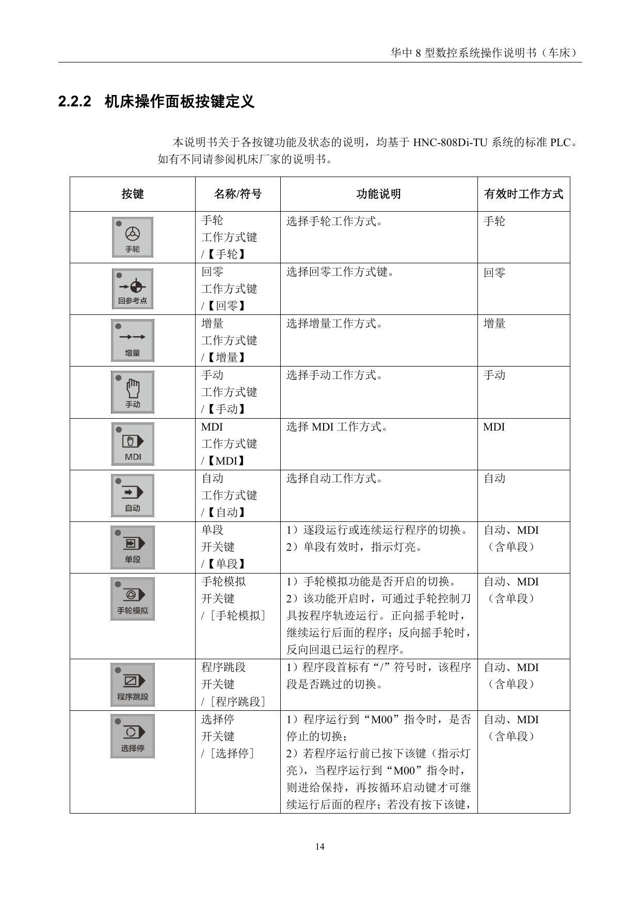
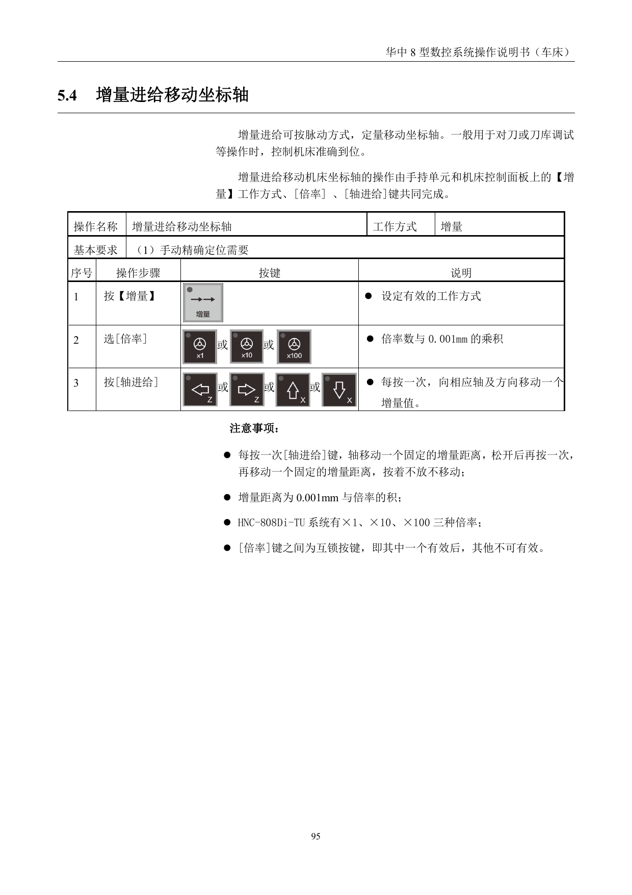
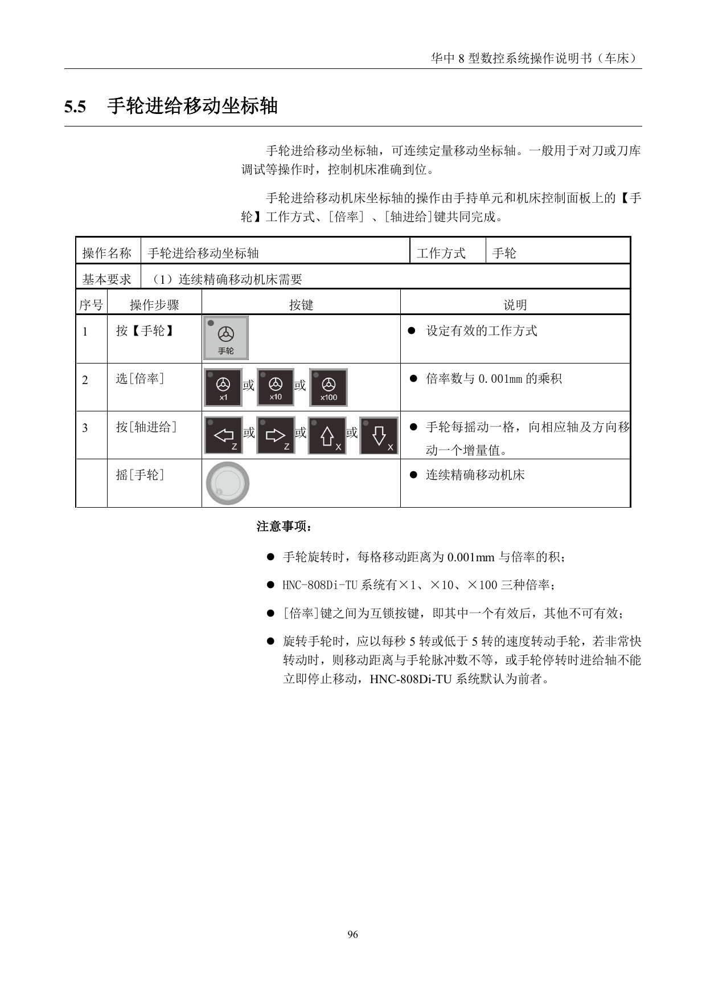
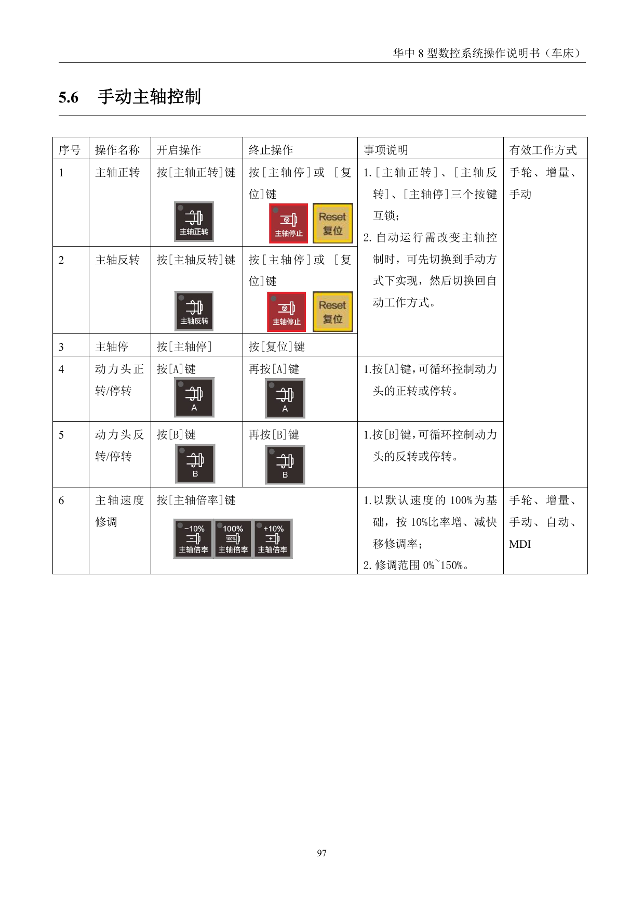
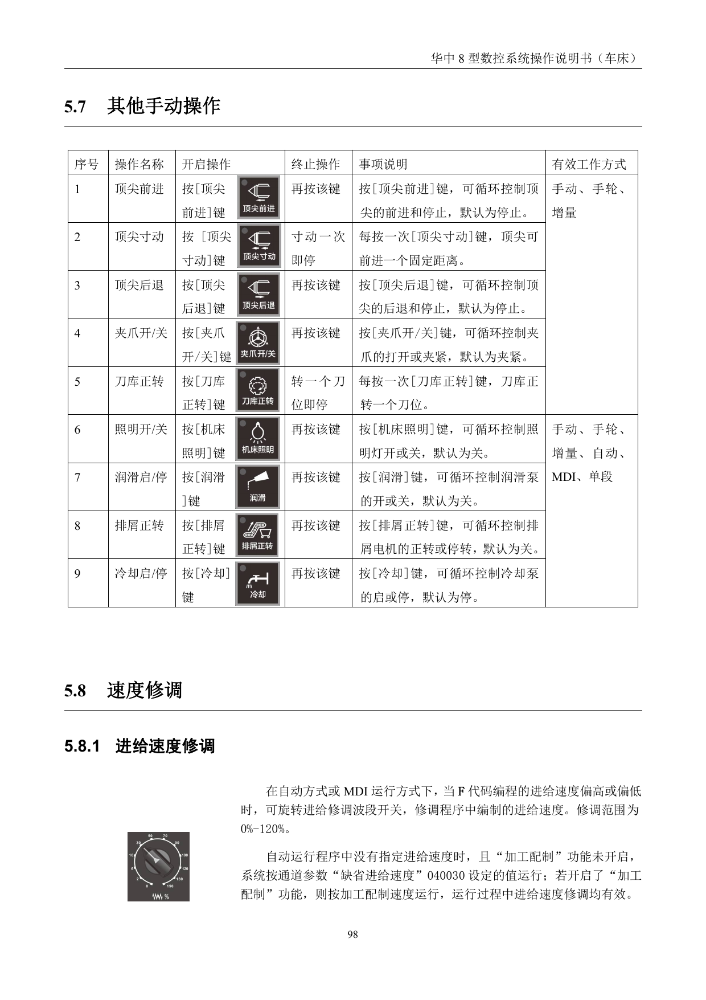

# 刀架移动及安全操作

> 章节归档：`chapter_03 / 3.2`  
> 适用对象：刚开始接触数控车床操控面的新人  
> 学习定位：先认清工作方式和按钮，再做手动移动、手轮控制和速度修调

## 一、学习目标

学完本讲义后，你应该能够：

1. 识别数控车床常见工作方式键和控制键。
2. 用手动、增量和手轮方式完成坐标轴移动。
3. 说清主轴、进给和快移速度修调的含义。
4. 说明进给保持、循环启动和超程解除的使用场景。
5. 在移动刀架或坐标轴时先确保安全状态，再继续操作。

## 二、先认清控制面板

数控车床上最重要的不是“按得快”，而是先把模式选对。很多按钮只有在特定方式下才有效，按钮之间还常常互锁。

### 2.1 常见工作方式

- `手动`：适合连续点动、快速移动和基础操作。
- `增量`：适合按固定步距移动坐标轴。
- `手轮`：适合更细的微调。
- `MDI`：适合输入一行或几行简单指令。
- `自动`：适合程序运行。
- `单段`：适合逐行观察程序。

### 2.2 常见功能键

- `回参考点`：建立机床坐标系。
- `超程解除`：在超程报警时，帮助机床退回安全区。
- `循环启动`：让程序继续运行。
- `进给保持`：临时暂停进给，便于观察和处理。
- `主轴正转 / 停止`：控制主轴启停。

## 三、手动和增量移动坐标轴

### 3.1 手动工进移动坐标轴

手动工进通常用于简单找位，操作时先按 `手动`，再按对应轴的方向键。

### 3.2 增量进给移动坐标轴

增量进给适合按固定距离一步一步移动坐标轴。

操作思路是：

1. 先按 `增量`。
2. 选择倍率 `x1`、`x10`、`x100` 之类的档位。
3. 再按 `轴进给` 键。

常见规则是：

- 每按一次，轴移动一个固定增量值。
- 增量值通常由倍率和系统设定共同决定。
- 这类移动适合刀架靠近工件前的安全确认。

### 3.3 手轮进给

手轮适合更精细的微调。

要点只有三个：

1. 先选 `手轮`。
2. 再选轴和倍率。
3. 最后摇手轮。

## 四、主轴与速度修调

### 4.1 主轴控制

主轴通常有正转、反转、停止三种基本状态。

### 4.2 速度修调

速度修调一般分三类：

- 主轴倍率：调主轴转速。
- 进给修调：调程序中的进给速度。
- 快移修调：调快速移动速度。

常见理解方式是：

- 主轴倍率以 `100%` 为基准上下调。
- 进给修调主要在自动或 `MDI` 运行时生效。
- 快移修调多用于快速定位和空程移动。

### 4.3 进给保持

进给保持的作用，是让刀具相对工件的进给先停住，但不一定把整个系统都停掉。

这在自动加工、观察刀路、处理小异常时很有用。

## 五、其他常用手动操作

除了移动坐标轴，操作面板上还有一批常用按钮：

- 顶尖前进、顶尖寸动、顶尖后退
- 夹爪开/关
- 刀库正转
- 照明开/关
- 润滑启/停
- 排屑正转
- 冷却启/停

这些按钮的共同点是：

1. 先确认当前工作方式有效。
2. 再看按钮是否互锁。
3. 不熟悉时先停下来确认，别靠猜。

## 六、视频演示

先看视频，再回到按钮和步骤上复盘，会更容易把动作顺序记住。

### 6.1 刀架移动及安全操作

### 6.2 刀架移动

## 七、练习与例题（含参考答案与解析）

### 练习 1：工作方式

**题目：**要进行手轮微调时，先应该选择什么工作方式？

**参考答案：**先选择 `手轮` 工作方式。

**解析：**手轮操作必须先切到对应模式，再选轴和倍率，否则移动方式不成立。

### 练习 2：增量进给

**题目：**增量进给的核心特点是什么？

**参考答案：**每按一次轴进给键，轴移动一个固定增量值。

**解析：**增量进给不是连续移动，而是按设定步距一步一步走。

### 练习 3：进给保持

**题目：**进给保持的作用是什么？

**参考答案：**临时暂停刀具进给，便于观察或处理，但不等于整机断电。

**解析：**进给保持适合临时干预，不是关机键。

### 练习 4：速度修调

**题目：**哪一类修调主要用于调整程序运行中的进给速度？

**参考答案：**进给修调。

**解析：**进给修调针对程序 F 速度，常在自动或 MDI 运行中使用。

### 例题 1：操作判断

**题目：**为什么在移动刀架前要先确认工作方式？

**参考答案：**因为很多按钮只在特定工作方式下有效，选错方式会导致按钮无效或动作不符合预期。

**解析：**工作方式是前提，按钮只是执行手段。

### 例题 2：安全处理

**题目：**如果刀架移动时发现方向不对，最稳妥的处理顺序是什么？

**参考答案：**先停下或松开按键，再确认模式和方向，必要时退回安全区后再继续。

**解析：**先消除错误动作，再重新确认，避免带错方向继续走。

## 八、本章小结

刀架移动看上去只是按键，实际上是“模式、方向、倍率、速度”四件事一起决定的。

- 先选对方式。
- 再选对轴和倍率。
- 再看速度修调。
- 出现异常先停，再查，再继续。

把这套顺序养成习惯，后面的对刀和自动加工才稳得住。
