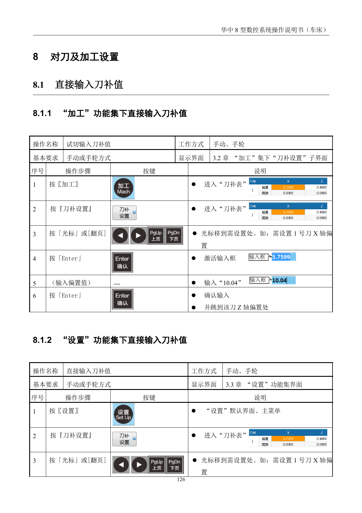
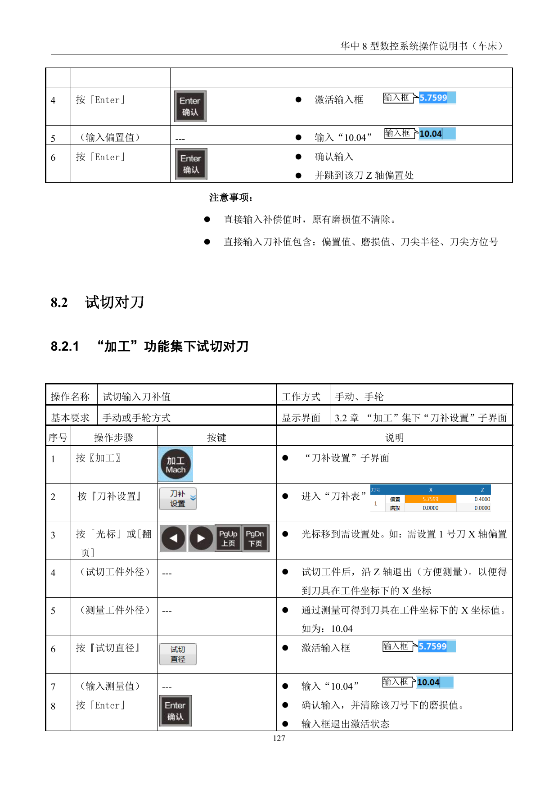
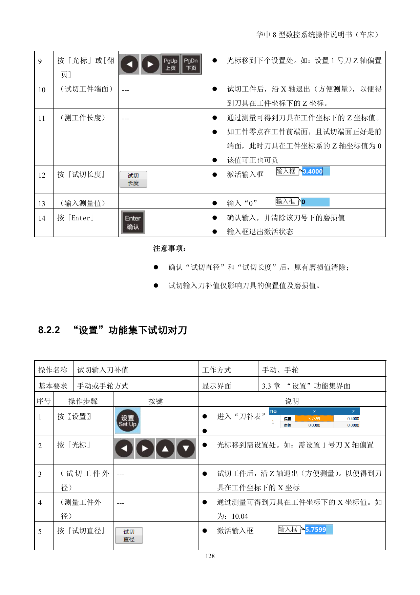
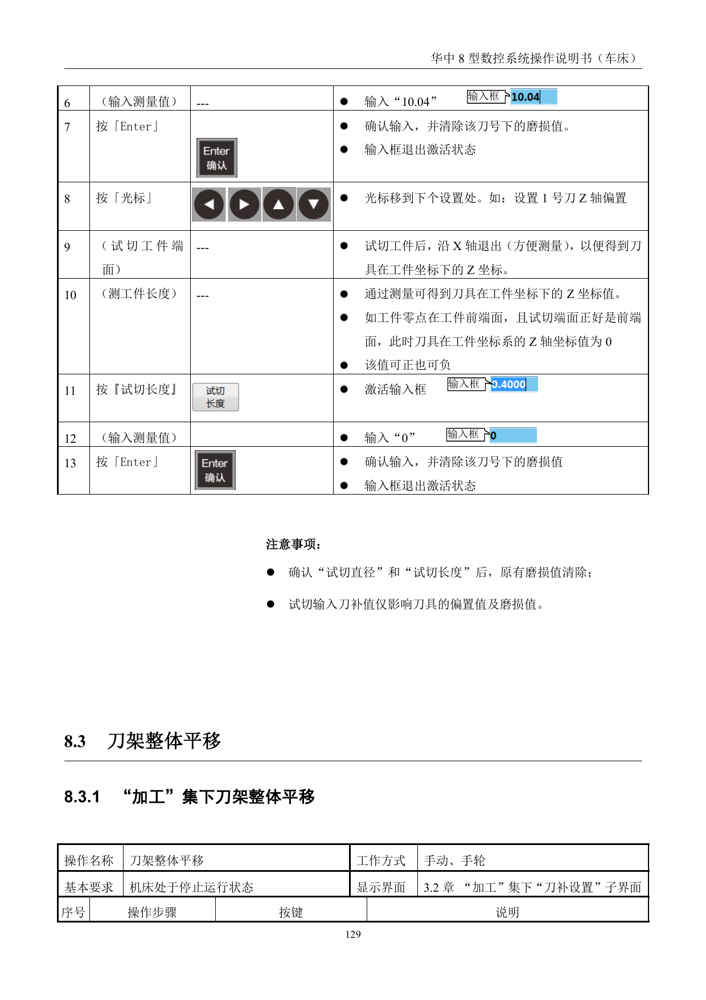

# 对刀及加工设置

> 章节归档：`chapter_03 / 3.3`  
> 适用对象：已经会基本手动移动坐标轴的新学员  
> 学习定位：先把刀补表看懂，再通过试切把 X、Z 方向的对刀值定准

## 一、学习目标

学完本讲义后，你应该能够：

1. 说清“加工”和“设置”功能集下进入刀补表的方法。
2. 说明直接输入刀补值和试切对刀的区别。
3. 根据试切结果判断 X 轴和 Z 轴刀补值的来源。
4. 说清刀架整体平移的用途和前提条件。
5. 通过视频和练习把对刀流程串成完整步骤。

## 二、先认识刀补表

数控车床做对刀，本质上是在建立“刀具坐标”和“工件坐标”之间的关系。

### 2.1 直接输入刀补值

在 `加工` 功能集下，可以直接进入刀补表输入偏置值。

在 `设置` 功能集下，也可以进入同样的刀补表界面。

常见可直接输入的内容包括：

- 偏置值
- 磨损值
- 刀尖半径
- 刀尖方位号

**注意：**直接输入刀补值时，原有磨损值不会自动清除。

### 2.2 为什么要先看刀补表

刀补表不是单纯的数字表，它对应的是每把刀在机床上的实际位置。

如果刀补值不准，后面的程序、尺寸和试切结果都会跟着偏。

## 三、试切对刀

试切对刀的思路很朴素：

1. 先用刀具切出一个可测量的表面。
2. 再把工件测出来。
3. 再把测得的尺寸回填到刀补里。

### 3.1 试切外径

在设置 1 号刀 X 轴偏置时，常见流程是：

1. 进入刀补表。
2. 选中需要设置的刀号和 X 轴位置。
3. 试切工件外径。
4. 沿 Z 轴退出，便于测量。
5. 测得工件外径后，把测量值写入对应位置。

### 3.2 试切长度

设置 Z 轴偏置时，常见流程是：

1. 先试切端面或长度方向。
2. 沿 X 轴退出，便于测量。
3. 测得工件长度后，把测量值写入对应位置。

### 3.3 试切时的理解要点

- X 轴对刀更关注外径。
- Z 轴对刀更关注长度方向。
- 如果零点就在工件前端面，且试切端面正好是前端面，则 Z 轴坐标值可为 0。
- 对刀值可正可负，关键是和机床坐标系一致。

## 四、刀架整体平移

刀架整体平移的作用，是在刀补设置的基础上，对整组刀具的参考位置做统一调整。

### 4.1 什么时候会用到

常见用途是：

- 机床停机后重新校正整体位置。
- 刀补基准需要整体修正。
- 更换工艺或重新建立参考后做统一偏移。

### 4.2 先记住前提

源资料里对这一节给出的前提很明确：

- 机床必须处于停止运行状态。
- 仍然是在 `加工` 集下的 `刀补设置` 子界面中处理。

## 五、视频演示

### 5.1 刀架换刀

这个视频适合和刀补、换刀动作一起看，帮助新人把“换刀 - 找刀 - 对刀”串起来。

## 六、练习与例题（含参考答案与解析）

### 练习 1：直接输入

**题目：**直接输入刀补值时，原有的什么值不会自动清除？

**参考答案：**原有磨损值不会自动清除。

**解析：**直接输入和磨损修正是不同层面的数据，输入时不会把历史磨损量清掉。

### 练习 2：X 轴对刀

**题目：**试切外径后，通常先处理哪一个方向的刀补？

**参考答案：**X 轴刀补。

**解析：**外径尺寸直接对应 X 方向位置，先把外径测准，再回填对应值。

### 练习 3：Z 轴对刀

**题目：**试切长度后，通常先处理哪一个方向的刀补？

**参考答案：**Z 轴刀补。

**解析：**长度方向主要对应 Z 轴位置。

### 练习 4：刀补内容

**题目：**刀补表里常见可以直接输入的内容有哪些？

**参考答案：**偏置值、磨损值、刀尖半径、刀尖方位号。

**解析：**这些项目共同描述刀具在机床中的实际工作状态。

### 例题 1：试切判断

**题目：**为什么试切后要先沿另一轴退出再测量？

**参考答案：**为了腾出测量空间，避免刀具继续接触工件影响测量结果和安全。

**解析：**先退刀，再测量，这是试切对刀的基本习惯。

### 例题 2：零点理解

**题目：**如果工件零点就在前端面，且试切端面也正好是前端面，Z 轴坐标能否为 0？

**参考答案：**可以。

**解析：**只要机床坐标系和工件基准定义一致，Z 值就可以是 0。

## 七、本章小结

对刀不是背数字，而是把刀、工件和坐标系对齐。

- 先看刀补表。
- 再做试切。
- 再回填 X、Z 值。
- 最后再考虑整组刀具的统一修正。

把这套逻辑走顺，后面的程序加工才有真正可控的基准。
