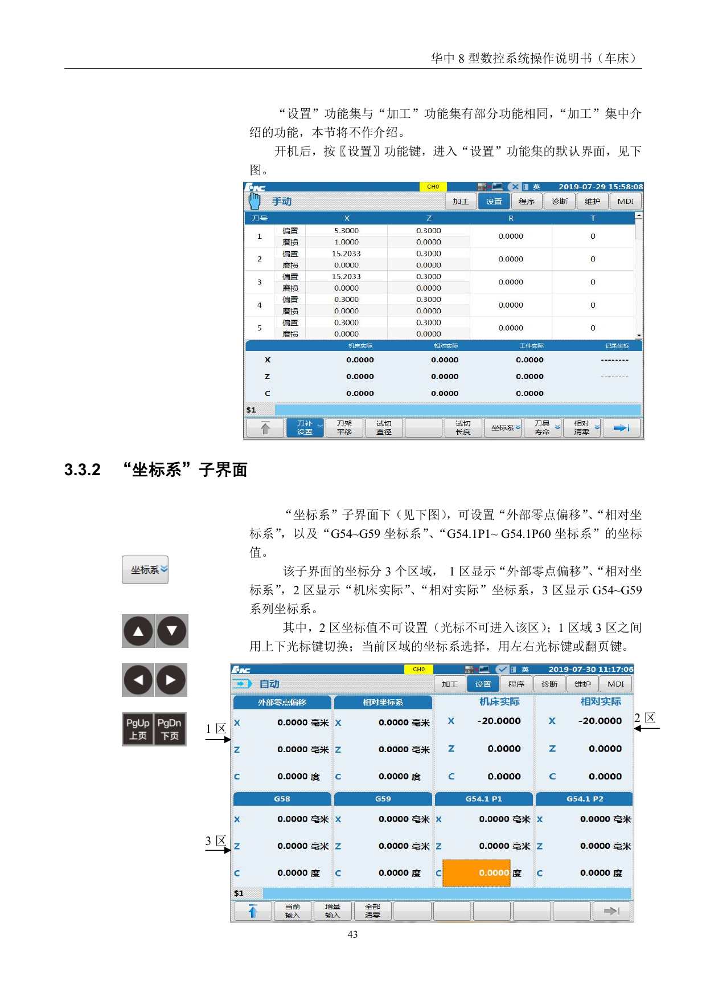
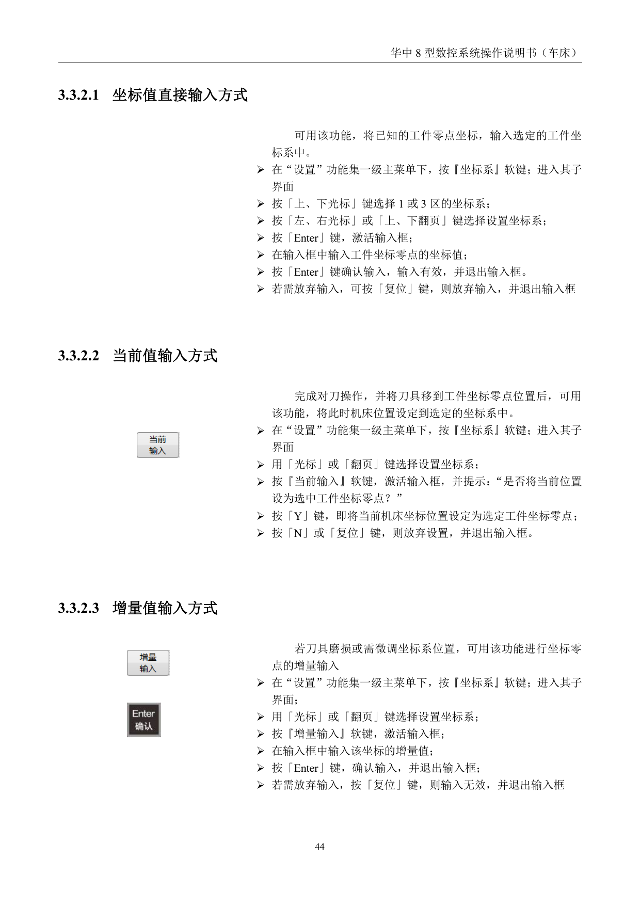

# 坐标系设置与输入方式

> 章节归档：`chapter_03 / 3.4`  
> 适用对象：已经接触过对刀和刀补表的新人  
> 学习定位：把工件坐标系的界面、三种输入方式和常见使用场景理清楚，后面做对刀和程序运行才不容易乱

## 一、学习目标

学完本讲义后，你应该能够：

1. 说清设置功能集里坐标系页面的几个区域各管什么。
2. 分辨直接输入、当前值输入、增量值输入三种方式。
3. 说出什么情况下适合用直接输入，什么情况下适合用当前值输入。
4. 说明增量输入通常用来做什么微调。
5. 把坐标系设置和后续对刀、加工之间的关系串起来。

## 二、先把坐标系界面看懂

华中数控系统的 `设置` 功能集里，坐标系不是一个孤立数字，而是一整组和工件零点有关的坐标区域。

### 2.1 这几个区域分别在看什么

- `外部零点偏移`：用于外部基准偏移的记录。
- `相对坐标系`：方便观察当前位置和移动量。
- `机床实际` / `相对实际`：显示当前真实坐标状态。
- `G54~G59`：常用的工件坐标系组。
- `G54.1P1~G54.1P60`：更多扩展工件坐标系。

### 2.2 哪些区能改，哪些区不能改

教程里明确说明了：

- `2 区` 只显示机床实际和相对实际坐标，不能直接进入修改。
- `1 区` 和 `3 区` 之间可以切换。
- 当前区域的坐标系，靠方向键或翻页键选择。

这件事很重要，因为新手最容易把“显示值”和“可设置值”混在一起。

## 三、直接输入方式

直接输入方式，适合你已经知道工件零点坐标值的时候。

### 3.1 它适合什么时候用

- 工件零点已经确定。
- 你手里已经有零点的坐标值。
- 需要把已知零点写进选定的工件坐标系。

### 3.2 基本操作顺序

1. 进入 `设置` 功能集。
2. 按 `坐标系` 软键，进入子界面。
3. 用上下光标选择 `1 区` 或 `3 区`。
4. 用左右光标或翻页键选定具体坐标系。
5. 按 `Enter` 激活输入框。
6. 输入工件坐标零点值。
7. 再按 `Enter` 确认。

### 3.3 记住一句话

直接输入，是“我已经知道答案，所以直接写进去”。

## 四、当前值输入方式

当前值输入，适合你已经把刀具移到工件零点位置，想把此时位置当成零点。

### 4.1 它适合什么时候用

- 已经完成对刀。
- 刀具已经到达工件零点位置。
- 需要把当前机床位置定义成选中工件坐标零点。

### 4.2 基本操作顺序

1. 进入 `设置` 功能集。
2. 进入 `坐标系` 子界面。
3. 选中要设置的工件坐标系。
4. 按 `当前输入` 软键。
5. 看到提示后按 `Y` 确认。
6. 如不设置，可按 `N` 或 `复位` 放弃。

### 4.3 记住一句话

当前值输入，是“我现在站对了地方，就把这地方记成零点”。

## 五、增量值输入方式

增量值输入，适合做微调。

### 5.1 它适合什么时候用

- 刀具有磨损。
- 坐标系需要小幅修正。
- 零点位置不需要重建，只需要挪一点。

### 5.2 基本操作顺序

1. 进入 `设置` 功能集。
2. 进入 `坐标系` 子界面。
3. 选中要微调的坐标系。
4. 按 `增量输入` 软键。
5. 输入增量值。
6. 按 `Enter` 确认。

### 5.3 记住一句话

增量输入，是“在原来基础上往前挪一点，往后挪一点”。

## 六、三种方式怎么选

- `直接输入`：已有零点数据，按数据写入。
- `当前值输入`：对刀完成后，把当前位置直接设为零点。
- `增量输入`：零点基本对了，只做小修正。

如果你把这三种方式混着用，最容易出现的问题不是系统报警，而是后面尺寸一串都偏。

## 七、课堂练习和例题

### 练习 1：分区理解

**题目：**坐标系界面里，哪一组区域不能直接设置？

**参考答案：**`2 区`。

**解析：**`2 区`只显示机床实际和相对实际坐标，不允许直接进入修改。

### 练习 2：直接输入

**题目：**已知工件零点坐标时，应该优先用哪种输入方式？

**参考答案：**直接输入方式。

**解析：**直接输入适合“已知答案”的场景，不需要先靠当前机床位置反推。

### 练习 3：当前值输入

**题目：**刀具已经对到工件零点位置后，最适合用哪种输入方式？

**参考答案：**当前值输入方式。

**解析：**当前值输入就是把此时的位置定义为工件零点。

### 练习 4：增量输入

**题目：**工件尺寸略有偏差，但零点基本正确时，适合用哪种方式？

**参考答案：**增量值输入方式。

**解析：**增量输入适合小范围修正，不需要重建整套坐标系。

### 例题 1：场景判断

**题目：**如果你刚完成对刀，刀尖正停在工件端面位置，下一步最适合做什么？

**参考答案：**用当前值输入，把当前位置设为选中的工件坐标零点。

**解析：**这时机床当前位置已经符合零点条件，直接登记最方便。

### 例题 2：微调判断

**题目：**工件批量加工中发现所有尺寸都整体偏大，但对刀流程没有明显错误，优先考虑什么处理方式？

**参考答案：**用增量输入做小幅修正。

**解析：**这类问题通常不必重建坐标系，先做微调更稳。

## 八、本章小结

坐标系这章最关键的是三个词：

- `已知值` 用直接输入。
- `当前位置` 用当前值输入。
- `小修正` 用增量输入。

把这三件事分清，后面试切对刀、程序运行和尺寸修正就会顺很多。
