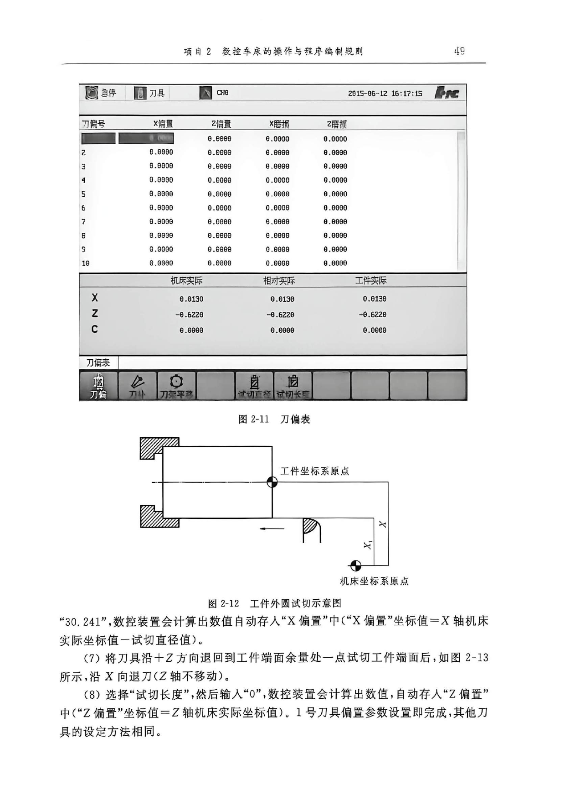
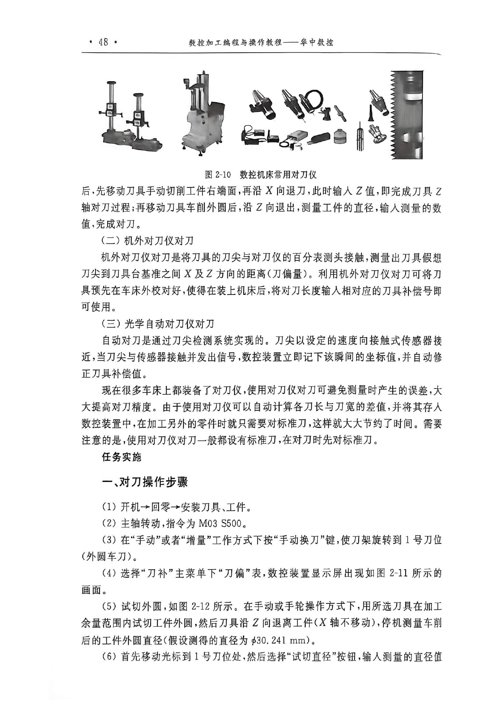
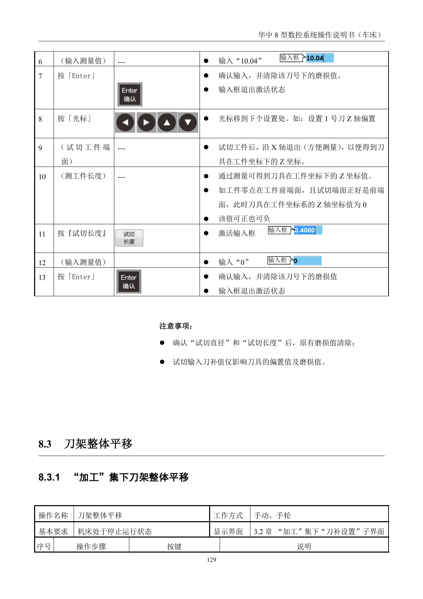

# 刀补设置与试切对刀

> 章节归档：`chapter_03 / 3.5`  
> 适用对象：已经会找坐标系、会进设置菜单的新人  
> 学习定位：把刀补表、试切直径、试切长度和刀架整体平移连成一条完整的实操链路

## 一、学习目标

学完本讲义后，你应该能够：

1. 说清刀补值试切输入方式的基本逻辑。
2. 区分直接输入刀补值和试切输入刀补值。
3. 按顺序完成 X 轴和 Z 轴的试切对刀。
4. 说明刀架整体平移的适用场景和前提条件。
5. 看懂对刀视频里“试切 - 测量 - 回填”的动作链。

## 二、先认识刀补表

刀补表记录的不是抽象数字，而是每把刀在机床里的实际工作位置。

### 2.1 直接输入和试切输入有什么不同

- `直接输入刀补值`：你已经知道偏置值，直接写进去。
- `试切输入刀补值`：你先试切，再测量，再把测量结果回填到系统里。

### 2.2 一个最容易记住的原则

- 直接输入时，原有磨损值不会自动清除。
- 试切输入确认后，系统会自动计算偏置值，并清除该刀的磨损值。

所以，直接输入适合“已有数据”，试切输入适合“现场建立数据”。

## 三、刀补值试切输入方式

试切对刀的本质，是确定工件坐标系和机床坐标系之间的位置关系。

### 3.1 先做 X 轴试切

常见步骤是：

1. 进入 `加工` 或 `设置` 功能集下的 `刀补设置`。
2. 把光标移到需要设置的刀号和 X 轴位置。
3. 试切工件外径。
4. 沿 `Z` 轴退出，便于测量。
5. 测量工件外径。
6. 按 `试切直径`，输入测量值。
7. 按 `Enter`，系统自动计算 X 轴偏置值。

### 3.2 再做 Z 轴试切

常见步骤是：

1. 将光标移到同一刀的 Z 轴位置。
2. 试切工件端面。
3. 沿 `X` 轴退出，便于测量。
4. 测量试切端面相对工件零点的距离。
5. 按 `试切长度`，输入测量值。
6. 按 `Enter`，系统自动计算 Z 轴偏置值。

### 3.3 现场要记住的细节

- 试切直径主要对应 X 轴偏置。
- 试切长度主要对应 Z 轴偏置。
- 试切后退出刀具，是为了测量安全和测量准确。
- 如果工件零点就在前端面，试切端面正好也是前端面，Z 值可能就是 0。

## 四、刀具偏置整体平移

有时候不是某一把刀错了，而是整组刀的基准都需要一起挪。

### 4.1 它适合什么场景

- 零件规格变了，但刀具之间的相对位置没变。
- 只需要让整套刀补值一起整体偏移。
- 机床停机后重新修正参考基准。

### 4.2 基本前提

源资料里写得很明确：

- 机床必须处于停止运行状态。
- 仍然是在 `加工` 功能集下的 `刀补设置` 子界面中处理。

### 4.3 输入时要注意什么

- 输入格式通常是 `X 偏移值 空格 Z 偏移值`。
- 格式错了，系统会提示输入无效。

## 五、对刀视频

### 5.1 对刀演示

这个视频适合和本章一起看，重点盯住三件事：

1. 刀具怎么试切。
2. 测量值怎么回填。
3. 刀补和坐标关系怎么建立。

## 六、课堂练习和例题

### 练习 1：直接输入

**题目：**直接输入刀补值时，原有的什么值不会自动清除？

**参考答案：**原有磨损值不会自动清除。

**解析：**直接输入只改输入项本身，不会把历史磨损量顺手清掉。

### 练习 2：试切直径

**题目：**试切外径后，通常按哪个软键回填测量值？

**参考答案：**`试切直径`。

**解析：**试切外径对应的是 X 轴偏置，系统会根据测量值自动计算。

### 练习 3：试切长度

**题目：**试切端面后，通常按哪个软键回填测量值？

**参考答案：**`试切长度`。

**解析：**试切长度对应的是 Z 轴偏置。

### 练习 4：整体平移

**题目：**当所有刀具都需要一起偏移时，应该用什么方法？

**参考答案：**刀架整体平移。

**解析：**整体平移适合整组刀补一起调整，而不是一把一把单独修。

### 例题 1：X 轴试切流程

**题目：**试切输入 X 轴偏置时，为什么要先沿 Z 轴退出？

**参考答案：**为了腾出测量空间，避免刀具继续接触工件，保证测量安全和准确。

**解析：**先退刀再测量，是试切对刀最基本的动作逻辑。

### 例题 2：Z 值理解

**题目：**如果工件零点在前端面，且试切端面正好也是前端面，Z 值为什么可能为 0？

**参考答案：**因为此时试切位置和工件零点重合。

**解析：**零点重合时，Z 方向坐标可以直接表现为 0。

## 七、本章小结

这章最核心的就是三句话：

- 先试切，再测量，再回填。
- X 看直径，Z 看长度。
- 整组刀一起挪，用刀架整体平移。

把这三句话记住，对刀和刀补设置就不会太乱。
