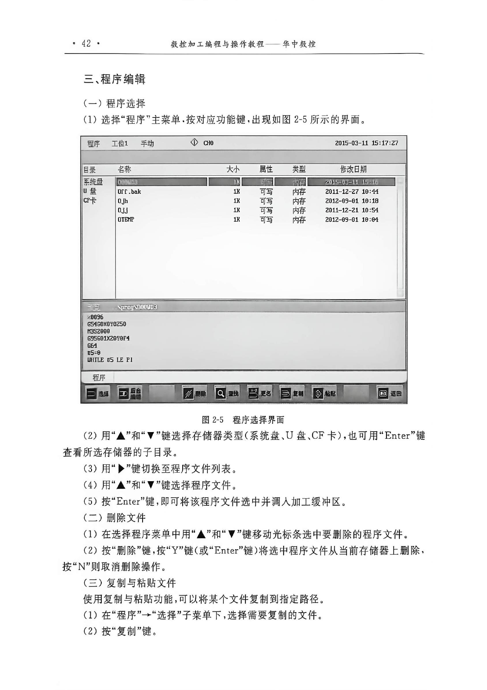
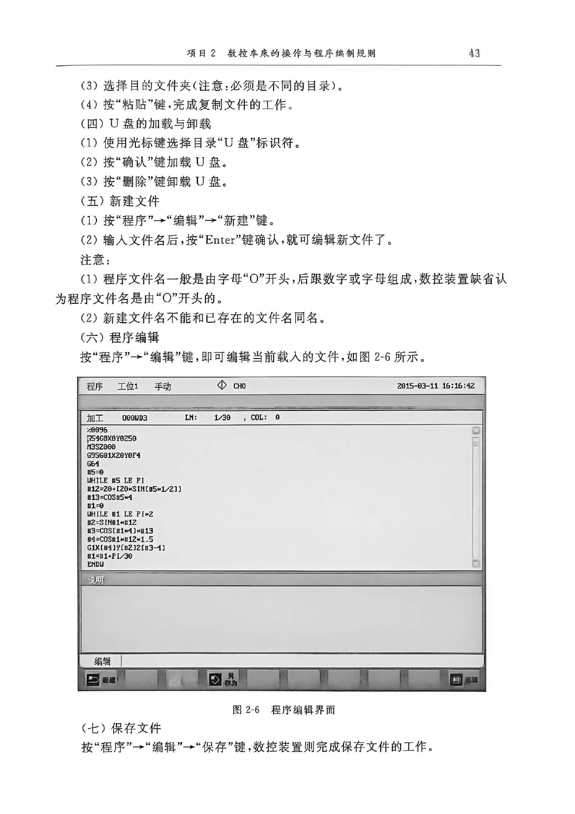
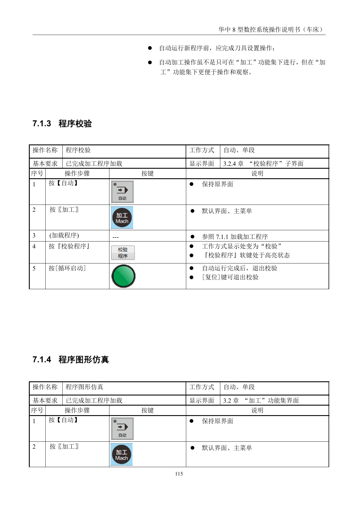

# 程序编辑与管理

> 章节归档：`chapter_03 / 3.6`  
> 适用对象：已经会进系统界面、会找程序的新学员  
> 学习定位：把程序查找、创建、编辑、保存和管理这些动作一次讲顺，后面自动运行才接得起来

## 一、学习目标

学完本讲义后，你应该能够：

1. 说清 `加工` 功能集和 `程序` 功能集查找程序的不同用途。
2. 按步骤完成程序的新建、编辑和保存。
3. 说清后台编辑、另存和复制粘贴的使用场景。
4. 完成程序删除、校验和重新运行的基本操作判断。
5. 把视频里的程序校验过程和讲义步骤对应起来。

## 二、先分清两个入口

在华中系统里，`加工` 和 `程序` 都能查找程序，但用途不一样。

### 2.1 `加工` 里的查找

`加工` 功能集下查到的程序，主要用于：

- 加载加工程序。
- 进入后台编辑。

### 2.2 `程序` 里的查找

`程序` 功能集下查到的程序，主要用于：

- 程序复制、粘贴、删除。
- 各盘之间的文件传输。
- 文件目录管理。

### 2.3 记住一句话

`加工` 更偏“干活”，`程序` 更偏“管文件”。

## 三、程序查找

程序查找可以分成两类：直接查找和目录查找。

### 3.1 直接查找

常见步骤是：

1. 进入 `加工` 或 `程序` 功能集。
2. 选择目标盘，如系统盘、U 盘、网盘或用户盘。
3. 按 `查找`。
4. 输入文件名。
5. 按 `Enter` 完成查找。

### 3.2 目录查找

如果文件在目录里，先打开目录，再查找。

这类操作的重点不是记住每一个按键，而是知道先选盘，再选目录，最后选文件。

## 四、程序新建和编辑

### 4.1 新建程序

程序名通常以 `O` 开头。

常见步骤是：

1. 进入 `加工` 或 `程序` 功能集。
2. 按 `新建`。
3. 输入程序名。
4. 按 `Enter`。
5. 进入编辑区。

### 4.2 编辑当前加载程序

如果当前程序已经加载，可以直接进入编辑状态修改。

### 4.3 后台编辑非加载程序

如果要改的不是当前加载程序，可以先在列表里找到它，再用 `后台编辑` 进入。

### 4.4 另存

另存的作用，是把当前编辑状态的程序快速复制成一份新文件。

这适合保留原程序不动，同时做新版本。

## 五、程序管理

### 5.1 复制与粘贴

复制粘贴的核心是把某个程序复制到指定目录或指定盘。

### 5.2 删除

删除之前先确认：

- 你删的是不是当前正在用的程序。
- 你是不是还需要保留一份备份。

### 5.3 重命名

重命名适合文件名不规范，或者程序用途变了，需要改名方便查找。

## 六、程序校验与重新运行

### 6.1 程序校验

程序校验的作用，是先检查程序有没有明显错误，再正式运行。

常见操作思路是：

1. 先加载程序。
2. 切到 `自动` 或 `单段`。
3. 按 `校验`。
4. 再按 `循环启动`。

### 6.2 停止和重运行

如果程序运行中需要暂停修改，可以先停止运行。

重新开始时，再用重运行把光标拉回程序头。

这一步很重要，因为它决定你是“接着跑”，还是“从头再跑”。

## 七、视频演示

### 7.1 程序校验

这个视频适合和程序校验步骤一起看，重点看“加载 - 校验 - 启动”这条线。

## 八、课堂练习和例题

### 练习 1：查找用途

**题目：**为什么 `加工` 和 `程序` 都能查找程序？

**参考答案：**因为两者用途不同，`加工` 主要用于加载和编辑，`程序` 主要用于文件管理。

**解析：**同样叫查找，但一个偏运行，一个偏管理。

### 练习 2：程序名

**题目：**新建程序名通常以什么字母开头？

**参考答案：**`O`。

**解析：**教程里明确说明程序文件名一般由字母 `O` 开头。

### 练习 3：后台编辑

**题目：**什么时候适合用后台编辑？

**参考答案：**当要修改的程序不是当前加载程序时。

**解析：**后台编辑适合先查找到目标程序，再进入编辑状态。

### 练习 4：程序校验

**题目：**程序校验的主要目的是什么？

**参考答案：**先检查程序有没有明显错误，再正式运行。

**解析：**校验能减少直接上机运行的风险。

### 例题 1：加载与管理

**题目：**如果你要把一个已有程序复制到另一个目录，应该更偏向用哪个功能集？

**参考答案：**`程序` 功能集。

**解析：**文件复制、粘贴、删除和重命名都更偏向程序管理场景。

### 例题 2：运行前检查

**题目：**为什么新程序在正式运行前最好先校验一次？

**参考答案：**因为可以提前发现明显错误，避免直接上机时出问题。

**解析：**校验是运行前的安全检查步骤。

## 九、本章小结

程序这章的主线其实很简单：

- 先找到程序。
- 再建好、改好、存好。
- 运行前先校验。
- 需要时再停止、重运行、重新整理。

把这条线打通，后面的自动运行就不会只剩按钮记忆。
