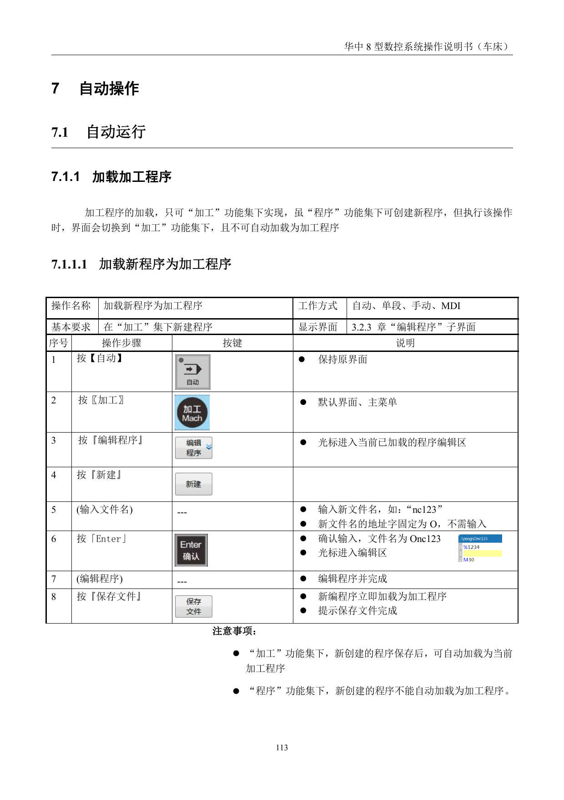
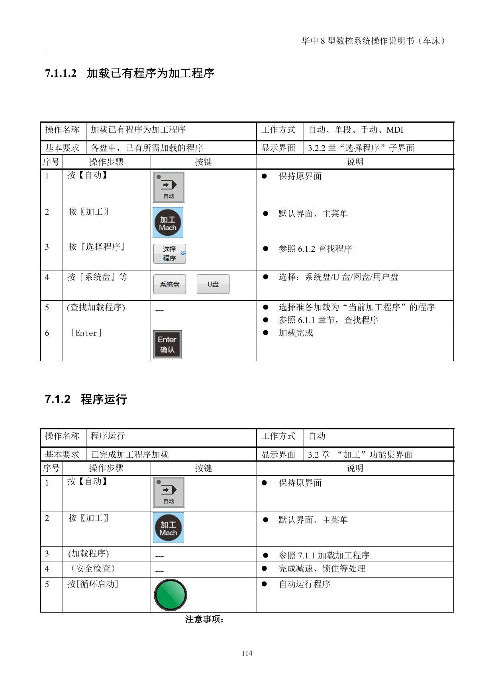
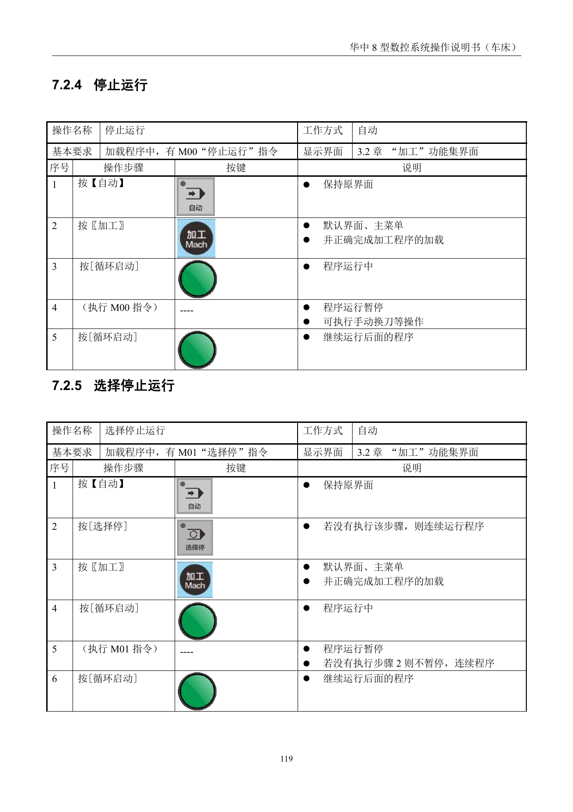

# 自动运行与运行控制

> 章节归档：`chapter_03 / 3.7`  
> 适用对象：已经能加载程序、理解程序校验的新学员  
> 学习定位：把自动运行、单段运行、跳段运行、任意行运行、暂停和终止这些控制动作分清楚

## 一、学习目标

学完本讲义后，你应该能够：

1. 按流程加载新程序或已有程序为加工程序。
2. 说明自动运行前必须完成哪些准备。
3. 区分单段运行、跳段运行和任意行运行。
4. 区分停止运行、选择停止、暂停运行和终止运行。
5. 看懂加工示例视频中程序运行和人为控制之间的关系。

## 二、加载加工程序

自动运行的第一步不是按 `循环启动`，而是先确认当前加工程序已经正确加载。

### 2.1 加载新程序

在 `加工` 功能集下新建并保存的程序，可以立即加载为当前加工程序。

要点是：

- 程序名输入后，系统会按规则生成程序文件名。
- 新程序编辑完成后要保存。
- 在 `加工` 功能集下新建保存，通常会加载为当前加工程序。

### 2.2 加载已有程序

已有程序通常通过 `加工` 功能集下的 `选择程序` 查找。

基本思路是：

1. 切到 `自动`。
2. 进入 `加工` 功能集。
3. 按 `选择程序`。
4. 选择系统盘、U 盘、网盘或用户盘。
5. 找到目标程序。
6. 按 `Enter` 加载。

## 三、自动运行

自动运行的基本条件是：

- 已经完成加工程序加载。
- 已经完成刀具设置。
- 已经完成必要安全检查。
- 机床处于适合自动运行的状态。

常见操作顺序是：

1. 按 `自动`。
2. 进入 `加工` 功能集。
3. 确认加工程序已经加载。
4. 做安全检查。
5. 按 `循环启动`。

自动运行不是“程序加载了就能放心跑”，真正的关键是运行前检查。

## 四、单段、跳段和任意行运行

### 4.1 单段运行

单段运行适合逐行观察程序。

每按一次 `循环启动`，系统运行一段程序，然后停下等待下一次启动。

它适合：

- 新程序第一次观察。
- 学员练习理解程序动作。
- 对刀路有疑问时逐段确认。

### 4.2 跳段运行

跳段运行依赖程序段前的 `/` 符号。

当按下 `程序跳段` 后，系统执行到带 `/` 的程序段时，会跳过该行。

注意：如果没有按下 `程序跳段`，即使程序段前有 `/`，系统仍按顺序执行。

### 4.3 任意行运行

任意行运行用于从指定行或指定 `N` 号开始执行。

源资料里特别提醒：

- 不得从子程序行开始。
- 用指定 `N` 号功能时，程序段首需要有地址 `N`。
- 任意行运行会受到扫描模式和轴到位顺序参数影响。

对新人来说，任意行运行不要当作“随便从中间跑”，它需要很清楚前面模态是否已经继承。

## 五、停止、选择停止、暂停和终止

### 5.1 停止运行 M00

当程序中有 `M00` 时，执行到这里会暂停。

暂停后可以执行手动换刀等操作，再按 `循环启动` 继续后面程序。

### 5.2 选择停止 M01

`M01` 是否停，要看有没有先按下 `选择停`。

- 按下 `选择停`：执行到 `M01` 时暂停。
- 没按 `选择停`：执行到 `M01` 时继续运行。

### 5.3 暂停运行

自动运行过程中按 `进给保持`，程序运行会暂停。

源资料提醒：螺纹加工过程中，进给保持不能立即生效，要等螺纹指令运行完成。

### 5.4 终止运行

终止运行比暂停更彻底。

常见顺序是：

1. 程序运行中先按 `进给保持`。
2. 切到 `手动`。
3. 手动关闭 MST 功能。
4. 按 `急停`，终止运行并复位。

## 六、加工示例视频

### 6.1 自动加工观察

看视频时重点观察：

1. 程序运行前是否已经完成准备。
2. 运行过程中哪些动作是自动执行。
3. 操作者什么时候需要暂停、观察或处理异常。

## 七、课堂练习和例题

### 练习 1：自动运行前提

**题目：**自动运行前，除了加载程序，还必须确认什么？

**参考答案：**必须确认刀具设置、安全检查和机床状态正常。

**解析：**程序能加载不代表可以直接加工，自动运行前的准备决定安全和加工质量。

### 练习 2：单段运行

**题目：**单段运行时，每按一次循环启动会发生什么？

**参考答案：**运行一段程序，然后等待下一次循环启动。

**解析：**单段运行适合逐行观察程序动作。

### 练习 3：跳段运行

**题目：**程序段前有 `/`，系统一定会跳过该行吗？

**参考答案：**不一定，只有按下 `程序跳段` 后才会跳过。

**解析：**跳段符和跳段按键要配合使用。

### 练习 4：选择停止

**题目：**`M01` 和 `M00` 的区别是什么？

**参考答案：**`M00` 执行到就停止，`M01` 只有在选择停有效时才停止。

**解析：**`M01` 是可选择的停止，不是无条件停止。

### 例题 1：暂停和终止

**题目：**加工中只是想临时观察刀路，应优先用进给保持还是急停？

**参考答案：**优先用进给保持。

**解析：**进给保持是暂停观察，急停是危险或紧急情况下的终止保护。

### 例题 2：任意行运行

**题目：**为什么任意行运行不能简单理解为“从任意位置随便开始跑”？

**参考答案：**因为目标行之前的模态、轴到位顺序和程序上下文可能影响加工结果。

**解析：**如果前面的模态没有正确继承，直接从中间运行可能导致动作错误。

## 八、本章小结

自动运行这章要记住：

- 先加载，再检查，再启动。
- 单段适合看清楚，跳段适合跳过标志段。
- 暂停用于观察，终止用于结束当前运行。
- 任意行运行要特别谨慎，不能脱离程序上下文。
