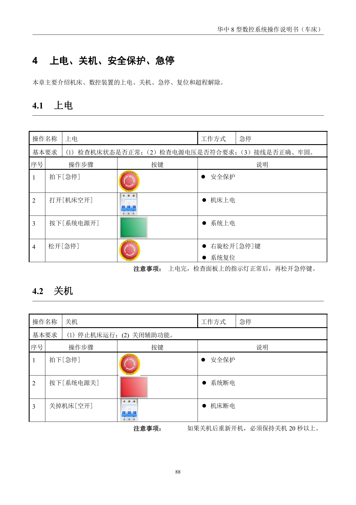
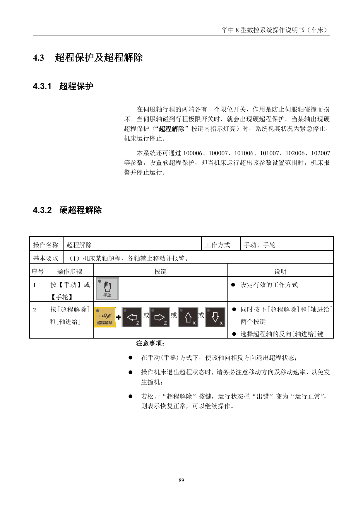
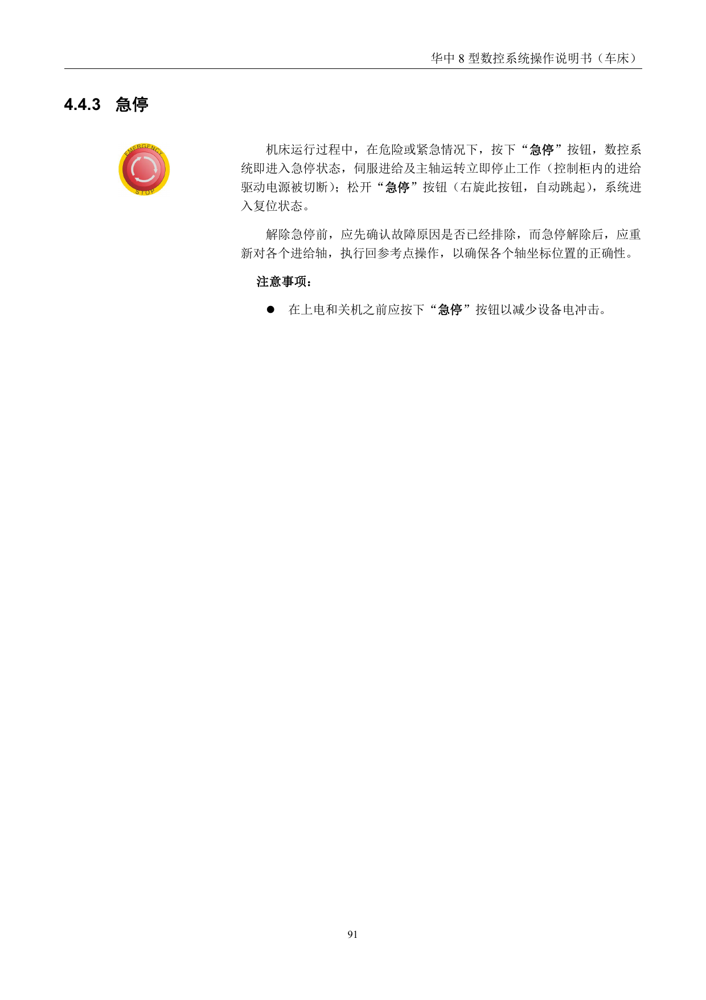

# 异常处理与手动运行复盘

> 章节归档：`chapter_03 / 3.8`  
> 适用对象：已经学完上电、手动移动、程序管理和自动运行的新学员  
> 学习定位：把急停、复位、超程解除、进给保持、MDI 和手动操作做一次安全复盘

## 一、学习目标

学完本讲义后，你应该能够：

1. 按正确顺序复述上电和关机的安全流程。
2. 区分硬超程和软超程的基本处理思路。
3. 说明急停、复位和进给保持的不同作用。
4. 在 MDI 和手动操作中控制主轴、手轮和连续进给。
5. 将异常处理规则用于后续训练和实操问答。

## 二、上电与关机再复盘



### 2.1 上电前要检查

上电前先确认：

- 机床状态正常。
- 电源电压符合要求。
- 接线正确、牢固。
- 急停已按下，机床处于安全初始状态。

上电完成后，检查面板指示灯正常，再松开急停。

### 2.2 关机顺序

关机前先停止机床运行，并关闭辅助功能。

基本顺序是：

1. 按下急停。
2. 关闭系统电源。
3. 关闭机床空开。

资料里还提醒：如果关机后重新开机，必须保持关机 20 秒以上。

## 三、超程保护和超程解除



### 3.1 硬超程

伺服轴行程两端通常有限位开关，用来防止伺服轴碰撞损坏。

当轴碰到行程极限开关时，会出现硬超程保护。此时系统按紧急停止处理，机床运行停止。

### 3.2 软超程

软超程由系统参数设置范围限制。

当机床运行超出参数设置范围时，系统报警并停止运行。

### 3.3 解除超程的核心

无论硬超程还是软超程，都要记住：

- 切到 `手动` 或 `手轮`。
- 沿超程轴的相反方向退出。
- 注意移动方向和移动速率。
- 恢复正常后再继续操作。

## 四、急停、复位和进给保持

### 4.1 进给保持

自动运行中按 `进给保持`，会让加工程序暂停。

但螺纹加工过程中不能立即停止，要等螺纹指令运行完成。

### 4.2 复位

当系统报警、坐标轴异常动作、异常输出或需要退出输入时，可以按 `复位`。

复位后的状态包括：

- 所有轴运行停止，螺纹加工过程除外。
- M、S 功能输出无效。
- 自动运行停止，模态功能保持。

### 4.3 急停

机床运行中遇到危险或紧急情况时，按下急停。

急停会使伺服进给和主轴立即停止，松开急停后系统进入复位状态。

解除急停前，必须先确认故障原因已经排除。解除急停后，应重新执行回参考点操作，确保坐标位置正确。



## 五、MDI 与手动操作复盘

### 5.1 MDI 运行主轴

在 MDI 方式下可以输入并执行一行或多行指令。

例如主轴正转：

```text
M03 S800
```

基本流程是：

1. 进入 MDI。
2. 输入指令。
3. 按 `输入`。
4. 选择单段或自动运行。
5. 按 `循环启动`。

### 5.2 手摇进给

手摇进给适合微调。

基本流程是：

1. 进入手摇或增量相关方式。
2. 选择 X 或 Z 轴。
3. 选择倍率。
4. 转动手轮。

### 5.3 手动连续进给和快速进给

手动连续进给适合低速找位。

如需快速进给，要配合快速键和方向键使用。新人练习时，快速进给必须特别谨慎。

## 六、课堂练习和例题

### 练习 1：上电细节

**题目：**上电完成后，为什么要先检查面板指示灯正常，再松开急停？

**参考答案：**为了确认系统上电状态正常，避免带着异常状态进入运行。

**解析：**急停松开后设备可能进入可运行状态，必须先确认显示和指示正常。

### 练习 2：重新开机

**题目：**关机后如果要重新开机，资料要求至少等待多久？

**参考答案：**20 秒以上。

**解析：**等待一段时间有利于系统电气状态稳定。

### 练习 3：超程方向

**题目：**解除超程时，轴应该向哪个方向移动？

**参考答案：**向超程轴的相反方向移动。

**解析：**超程已经到危险边界，继续同方向移动会增加撞机风险。

### 练习 4：复位作用

**题目：**复位后，M、S 功能输出会怎样？

**参考答案：**M、S 功能输出无效。

**解析：**复位会停止自动运行并使相关输出失效，但模态功能仍保持。

### 例题 1：急停后的处理

**题目：**急停解除后，为什么还要重新回参考点？

**参考答案：**为了重新确认各轴坐标位置，保证后续坐标判断正确。

**解析：**急停属于异常中断，解除后需要重新建立可靠的位置基准。

### 例题 2：MDI 指令

**题目：**在 MDI 中让主轴以 800 r/min 正转，应该输入什么？

**参考答案：**`M03 S800`。

**解析：**`M03` 表示主轴正转，`S800` 表示主轴转速。

## 七、本章小结

3.8 是第三章的安全收束：

- 上电关机按顺序。
- 超程要反向退。
- 急停后查原因，再回参考点。
- MDI 和手动操作都要先确认模式、轴向和倍率。

这些规则越熟，后面的加工训练越稳。
